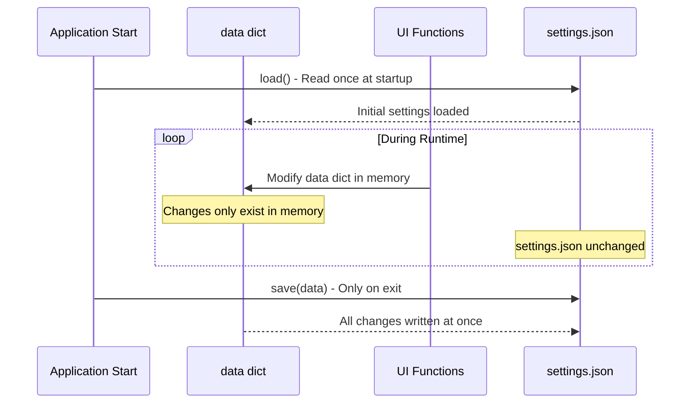
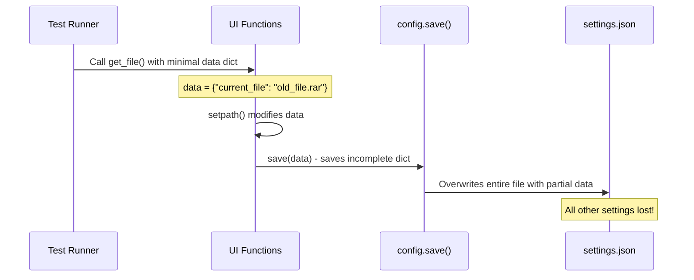

<!-- Generated by SpecStory, Markdown v2.1.0 -->

<!-- cursor Session 94f89326-0379-4435-aee1-beb51a668c96 (2025-08-17 22:29Z) -->

# Requirements.txt installation (2025-08-17 22:29Z)

_**User**_

Install the requirements.txt file

---

_**Agent (model claude-4-sonnet, mode Agent)**_

I'll help you install the requirements from the requirements.txt file. First, let me check if the requirements.txt file exists in your project.

---

<tool-use data-tool-type="generic" data-tool-name="glob_file_search">
<details>
<summary>Tool use: **glob_file_search** • Searched codebase "undefined" • **1** result in **1** directory</summary>

Directory: **undefined** (1 file)

| File |
|------|
| `.\requirements.txt` |

</details>
</tool-use>

---

Great! I found the requirements.txt file. Let me read its contents to see what packages need to be installed.

---

<tool-use data-tool-type="read" data-tool-name="read_file_v2">
<details><summary>Tool use: **read_file_v2** • Read file: c:\Users\18324\Documents\VSCodeProjects\Zippy\requirements.txt</summary>

</details>
</tool-use>

---

Now I'll install the requirements using pip. I'll run the installation command in your project directory.

---

<tool-use data-tool-type="shell" data-tool-name="run_terminal_command_v2">
<details><summary>Tool use: **run_terminal_command_v2** • Run command: pip install -r requirements.txt</summary>

```bash
pip install -r requirements.txt
```

```
Collecting Brotli==1.1.0 (from -r requirements.txt (line 1))
  Using cached Brotli-1.1.0-cp313-cp313-win_amd64.whl.metadata (5.6 kB)
Requirement already satisfied: colorama==0.4.6 in c:\users\18324\miniconda3\lib\site-packages (from -r requirements.txt (line 2)) (0.4.6)
Requirement already satisfied: context_menu==1.4.1 in c:\users\18324\documents\vscodeprojects\context_menu (from -r requirements.txt (line 3)) (1.4.1)
Collecting coverage==7.9.2 (from -r requirements.txt (line 4))
  Using cached coverage-7.9.2-cp313-cp313-win_amd64.whl.metadata (9.1 kB)
Collecting inflate64==1.0.1 (from -r requirements.txt (line 5))
  Using cached inflate64-1.0.1-cp313-cp313-win_amd64.whl
Collecting iniconfig==2.1.0 (from -r requirements.txt (line 6))
  Using cached iniconfig-2.1.0-py3-none-any.whl.metadata (2.7 kB)
Collecting multivolumefile==0.2.3 (from -r requirements.txt (line 7))
  Using cached multivolumefile-0.2.3-py3-none-any.whl.metadata (6.3 kB)
Collecting packaging==25.0 (from -r requirements.txt (line 8))
  Using cached packaging-25.0-py3-none-any.whl.metadata (3.3 kB)
Collecting pillow==11.1.0 (from -r requirements.txt (line 9))
  Using cached pillow-11.1.0-cp313-cp313-win_amd64.whl.metadata (9.3 kB)
Collecting pluggy==1.6.0 (from -r requirements.txt (line 10))
  Using cached pluggy-1.6.0-py3-none-any.whl.metadata (4.8 kB)
Collecting psutil==7.0.0 (from -r requirements.txt (line 11))
  Using cached psutil-7.0.0-cp37-abi3-win_amd64.whl.metadata (23 kB)
Collecting pybcj==1.0.3 (from -r requirements.txt (line 12))
  Using cached pybcj-1.0.3-cp313-cp313-win_amd64.whl.metadata (4.0 kB)
Collecting pycryptodomex==3.22.0 (from -r requirements.txt (line 13))
  Using cached pycryptodomex-3.22.0-cp37-abi3-win_amd64.whl.metadata (3.4 kB)
Collecting Pygments==2.19.2 (from -r requirements.txt (line 14))
  Using cached pygments-2.19.2-py3-none-any.whl.metadata (2.5 kB)
Collecting pyppmd==1.1.1 (from -r requirements.txt (line 15))
  Using cached pyppmd-1.1.1-cp313-cp313-win_amd64.whl
Collecting pystray==0.19.5 (from -r requirements.txt (line 16))
  Using cached pystray-0.19.5-py2.py3-none-any.whl.metadata (9.4 kB)
Collecting pytest==8.4.1 (from -r requirements.txt (line 17))
  Using cached pytest-8.4.1-py3-none-any.whl.metadata (7.7 kB)
Collecting pyzstd==0.16.2 (from -r requirements.txt (line 18))
  Using cached pyzstd-0.16.2-cp313-cp313-win_amd64.whl.metadata (2.5 kB)
Requirement already satisfied: setuptools==78.1.1 in c:\users\18324\miniconda3\lib\site-packages (from -r requirements.txt (line 19)) (78.1.1)
Collecting six==1.17.0 (from -r requirements.txt (line 20))
  Using cached six-1.17.0-py2.py3-none-any.whl.metadata (1.7 kB)
Collecting texttable==1.7.0 (from -r requirements.txt (line 21))
  Using cached texttable-1.7.0-py2.py3-none-any.whl.metadata (9.8 kB)
Collecting unrar==0.4 (from -r requirements.txt (line 22))
  Using cached unrar-0.4-py3-none-any.whl.metadata (3.0 kB)
Requirement already satisfied: wheel==0.45.1 in c:\users\18324\miniconda3\lib\site-packages (from -r requirements.txt (line 23)) (0.45.1)
Using cached Brotli-1.1.0-cp313-cp313-win_amd64.whl (358 kB)
Using cached coverage-7.9.2-cp313-cp313-win_amd64.whl (215 kB)
Using cached iniconfig-2.1.0-py3-none-any.whl (6.0 kB)
Using cached multivolumefile-0.2.3-py3-none-any.whl (17 kB)
Using cached packaging-25.0-py3-none-any.whl (66 kB)
Using cached pillow-11.1.0-cp313-cp313-win_amd64.whl (2.6 MB)
Using cached pluggy-1.6.0-py3-none-any.whl (20 kB)
Using cached psutil-7.0.0-cp37-abi3-win_amd64.whl (244 kB)
Using cached pybcj-1.0.3-cp313-cp313-win_amd64.whl (24 kB)
Using cached pycryptodomex-3.22.0-cp37-abi3-win_amd64.whl (1.8 MB)
Using cached pygments-2.19.2-py3-none-any.whl (1.2 MB)
Using cached pystray-0.19.5-py2.py3-none-any.whl (49 kB)
Using cached pytest-8.4.1-py3-none-any.whl (365 kB)
Using cached pyzstd-0.16.2-cp313-cp313-win_amd64.whl (245 kB)
Using cached six-1.17.0-py2.py3-none-any.whl (11 kB)
Using cached texttable-1.7.0-py2.py3-none-any.whl (10 kB)
Using cached unrar-0.4-py3-none-any.whl (25 kB)
Installing collected packages: unrar, texttable, Brotli, six, pyzstd, pyppmd, Pygments, pycryptodomex, pybcj, psutil, pluggy, pillow, packaging, multivolumefile, iniconfig, inflate64, coverage, pytest, pystray
  Attempting uninstall: Brotli
    Found existing installation: Brotli 1.0.9
    Uninstalling Brotli-1.0.9:
      Successfully uninstalled Brotli-1.0.9
  Attempting uninstall: Pygments
    Found existing installation: Pygments 2.19.1
    Uninstalling Pygments-2.19.1:
      Successfully uninstalled Pygments-2.19.1
  Attempting uninstall: pluggy
    Found existing installation: pluggy 1.5.0
    Uninstalling pluggy-1.5.0:
      Successfully uninstalled pluggy-1.5.0
  Attempting uninstall: packaging
    Found existing installation: packaging 24.2
    Uninstalling packaging-24.2:
      Successfully uninstalled packaging-24.2


Successfully installed Brotli-1.1.0 Pygments-2.19.2 coverage-7.9.2 inflate64-1.0.1 iniconfig-2.1.0 multivolumefile-0.2.3 packaging-25.0 pillow-11.1.0 pluggy-1.6.0 psutil-7.0.0 pybcj-1.0.3 pycryptodomex-3.22.0 pyppmd-1.1.1 pystray-0.19.5 pytest-8.4.1 pyzstd-0.16.2 six-1.17.0 texttable-1.7.0 unrar-0.4

```
</details>
</tool-use>

---

Perfect! The requirements.txt file has been successfully installed. Here's a summary of what happened:

✅ **Installation completed successfully!**

The following packages were installed or updated:
- **New installations**: Brotli, coverage, inflate64, iniconfig, multivolumefile, packaging, pillow, pluggy, psutil, pybcj, pycryptodomex, Pygments, pyppmd, pystray, pytest, pyzstd, six, texttable, unrar
- **Already satisfied**: colorama, context_menu, setuptools, wheel

Some packages were updated to newer versions:
- Brotli: 1.0.9 → 1.1.0
- Pygments: 2.19.1 → 2.19.2
- pluggy: 1.5.0 → 1.6.0
- packaging: 24.2 → 25.0

All dependencies for your Zippy project are now installed and ready to use. You can now run your Python application with all the required packages available.

---

_**User**_

Use the conda environment named zippy

---

_**Agent (model claude-4-sonnet, mode Agent)**_

I'll help you activate the conda environment named "zippy". Let me activate it for you.

---

<tool-use data-tool-type="shell" data-tool-name="run_terminal_command_v2">
<details><summary>Tool use: **run_terminal_command_v2** • Run command: conda activate zippy</summary>

```bash
conda activate zippy
```
</details>
</tool-use>

---

Great! The conda environment "zippy" has been activated successfully. Let me verify that we're now using the correct environment by checking the current conda environment:

---

<tool-use data-tool-type="shell" data-tool-name="run_terminal_command_v2">
<details><summary>Tool use: **run_terminal_command_v2** • Run command: conda info --envs</summary>

```bash
conda info --envs
```

```

# conda environments:
#
base                   C:\Users\18324\Miniconda3
context_menu           C:\Users\18324\Miniconda3\envs\context_menu
interview              C:\Users\18324\Miniconda3\envs\interview
testbed                C:\Users\18324\Miniconda3\envs\testbed
zippy                * C:\Users\18324\Miniconda3\envs\zippy
                       C:\Users\18324\anaconda3
                       C:\Users\18324\anaconda3\envs\Interview_Prep
                       C:\Users\18324\anaconda3\envs\ML
                       C:\Users\18324\anaconda3\envs\MachineLearning
                       C:\Users\18324\anaconda3\envs\PyTorch
                       C:\Users\18324\anaconda3\envs\Zippy
                       C:\Users\18324\anaconda3\envs\interview
                       C:\Users\18324\anaconda3\envs\testbed
                       C:\Users\18324\anaconda3\envs\tf_env
                       C:\Users\18324\miniconda3
context_menu           C:\Users\18324\miniconda3\envs\context_menu
interview              C:\Users\18324\miniconda3\envs\interview
testbed                C:\Users\18324\miniconda3\envs\testbed
                       c:\Users\18324\anaconda3\envs\tf_env


```
</details>
</tool-use>

---

Perfect! ✅ The conda environment "zippy" is now active (indicated by the asterisk `*` next to it in the list).

You're now working in the zippy conda environment located at `C:\Users\18324\Miniconda3\envs\zippy`. Any Python packages you install or Python commands you run will now use this environment.

If you previously installed the requirements.txt in a different environment, you may want to reinstall them in this zippy environment to ensure all dependencies are available:

---

<tool-use data-tool-type="shell" data-tool-name="run_terminal_command_v2">
<details><summary>Tool use: **run_terminal_command_v2** • Run command: pip install -r requirements.txt</summary>

```bash
pip install -r requirements.txt
```

```
Collecting Brotli==1.1.0 (from -r requirements.txt (line 1))
  Using cached brotli-1.1.0-cp314-cp314-win_amd64.whl
Collecting colorama==0.4.6 (from -r requirements.txt (line 2))
  Using cached colorama-0.4.6-py2.py3-none-any.whl.metadata (17 kB)
Collecting context_menu==1.4.1 (from -r requirements.txt (line 3))
  Using cached context_menu-1.4.1-py3-none-any.whl.metadata (15 kB)
Collecting coverage==7.9.2 (from -r requirements.txt (line 4))
  Using cached coverage-7.9.2-py3-none-any.whl.metadata (8.9 kB)
Collecting inflate64==1.0.1 (from -r requirements.txt (line 5))
  Using cached inflate64-1.0.1-cp314-cp314-win_amd64.whl
Collecting iniconfig==2.1.0 (from -r requirements.txt (line 6))
  Using cached iniconfig-2.1.0-py3-none-any.whl.metadata (2.7 kB)
Collecting multivolumefile==0.2.3 (from -r requirements.txt (line 7))
  Using cached multivolumefile-0.2.3-py3-none-any.whl.metadata (6.3 kB)
Requirement already satisfied: packaging==25.0 in C:\Users\18324\Miniconda3\envs\zippy\Lib\site-packages (from -r requirements.txt (line 8)) (25.0)
Collecting pillow==11.1.0 (from -r requirements.txt (line 9))
  Using cached pillow-11.1.0.tar.gz (46.7 MB)
  Installing build dependencies: started
  Installing build dependencies: finished with status 'done'
  Getting requirements to build wheel: started
  Getting requirements to build wheel: finished with status 'done'
  Preparing metadata (pyproject.toml): started
  Preparing metadata (pyproject.toml): finished with status 'done'
Collecting pluggy==1.6.0 (from -r requirements.txt (line 10))
  Using cached pluggy-1.6.0-py3-none-any.whl.metadata (4.8 kB)
Collecting psutil==7.0.0 (from -r requirements.txt (line 11))
  Using cached psutil-7.0.0-cp37-abi3-win_amd64.whl.metadata (23 kB)
Collecting pybcj==1.0.3 (from -r requirements.txt (line 12))
  Using cached pybcj-1.0.3-cp314-cp314-win_amd64.whl
Collecting pycryptodomex==3.22.0 (from -r requirements.txt (line 13))
  Using cached pycryptodomex-3.22.0-cp37-abi3-win_amd64.whl.metadata (3.4 kB)
Collecting Pygments==2.19.2 (from -r requirements.txt (line 14))
  Using cached pygments-2.19.2-py3-none-any.whl.metadata (2.5 kB)
Collecting pyppmd==1.1.1 (from -r requirements.txt (line 15))
  Using cached pyppmd-1.1.1-cp314-cp314-win_amd64.whl
Collecting pystray==0.19.5 (from -r requirements.txt (line 16))
  Using cached pystray-0.19.5-py2.py3-none-any.whl.metadata (9.4 kB)
Collecting pytest==8.4.1 (from -r requirements.txt (line 17))
  Using cached pytest-8.4.1-py3-none-any.whl.metadata (7.7 kB)
Collecting pyzstd==0.16.2 (from -r requirements.txt (line 18))
  Using cached pyzstd-0.16.2-cp314-cp314-win_amd64.whl
Collecting setuptools==78.1.1 (from -r requirements.txt (line 19))
  Using cached setuptools-78.1.1-py3-none-any.whl.metadata (6.5 kB)
Collecting six==1.17.0 (from -r requirements.txt (line 20))
  Using cached six-1.17.0-py2.py3-none-any.whl.metadata (1.7 kB)
Collecting texttable==1.7.0 (from -r requirements.txt (line 21))
  Using cached texttable-1.7.0-py2.py3-none-any.whl.metadata (9.8 kB)
Collecting unrar==0.4 (from -r requirements.txt (line 22))
  Using cached unrar-0.4-py3-none-any.whl.metadata (3.0 kB)
Collecting wheel==0.45.1 (from -r requirements.txt (line 23))
  Using cached wheel-0.45.1-py3-none-any.whl.metadata (2.3 kB)
Using cached colorama-0.4.6-py2.py3-none-any.whl (25 kB)
Using cached context_menu-1.4.1-py3-none-any.whl (17 kB)
Using cached coverage-7.9.2-py3-none-any.whl (204 kB)
Using cached iniconfig-2.1.0-py3-none-any.whl (6.0 kB)
Using cached multivolumefile-0.2.3-py3-none-any.whl (17 kB)
Using cached pluggy-1.6.0-py3-none-any.whl (20 kB)
Using cached psutil-7.0.0-cp37-abi3-win_amd64.whl (244 kB)
Using cached pycryptodomex-3.22.0-cp37-abi3-win_amd64.whl (1.8 MB)
Using cached pygments-2.19.2-py3-none-any.whl (1.2 MB)
Using cached pystray-0.19.5-py2.py3-none-any.whl (49 kB)
Using cached pytest-8.4.1-py3-none-any.whl (365 kB)
Using cached setuptools-78.1.1-py3-none-any.whl (1.3 MB)
Using cached six-1.17.0-py2.py3-none-any.whl (11 kB)
Using cached texttable-1.7.0-py2.py3-none-any.whl (10 kB)
Using cached unrar-0.4-py3-none-any.whl (25 kB)
Using cached wheel-0.45.1-py3-none-any.whl (72 kB)
Building wheels for collected packages: pillow
  Building wheel for pillow (pyproject.toml): started
  Building wheel for pillow (pyproject.toml): finished with status 'error'
Failed to build pillow
  error: subprocess-exited-with-error
  
  Building wheel for pillow (pyproject.toml) did not run successfully.
  exit code: 1
  
  [284 lines of output]
  C:\Users\18324\AppData\Local\Temp\pip-build-env-ow5xn4fg\overlay\Lib\site-packages\setuptools\config\_apply_pyprojecttoml.py:82: SetuptoolsDeprecationWarning: &#96;project.license&#96; as a TOML table is deprecated
  !!
  
          ********************************************************************************
          Please use a simple string containing a SPDX expression for &#96;project.license&#96;. You can also use &#96;project.license-files&#96;. (Both options available on setuptools&gt;=77.0.0).
  
          By 2027-Feb-18, you need to update your project and remove deprecated calls
          or your builds will no longer be supported.
  
          See https://packaging.python.org/en/latest/guides/writing-pyproject-toml/#license for details.
          ********************************************************************************
  
  !!
    corresp(dist, value, root_dir)
  C:\Users\18324\AppData\Local\Temp\pip-build-env-ow5xn4fg\overlay\Lib\site-packages\setuptools\config\_apply_pyprojecttoml.py:61: SetuptoolsDeprecationWarning: License classifiers are deprecated.
  !!
  
          ********************************************************************************
          Please consider removing the following classifiers in favor of a SPDX license expression:
  
          License :: OSI Approved :: CMU License (MIT-CMU)
  
          See https://packaging.python.org/en/latest/guides/writing-pyproject-toml/#license for details.
          ********************************************************************************
  
  !!
    dist._finalize_license_expression()
  C:\Users\18324\AppData\Local\Temp\pip-build-env-ow5xn4fg\overlay\Lib\site-packages\setuptools\dist.py:765: SetuptoolsDeprecationWarning: License classifiers are deprecated.
  !!
  
          ********************************************************************************
          Please consider removing the following classifiers in favor of a SPDX license expression:
  
          License :: OSI Approved :: CMU License (MIT-CMU)
  
          See https://packaging.python.org/en/latest/guides/writing-pyproject-toml/#license for details.
          ********************************************************************************
  
  !!
    self._finalize_license_expression()
  running bdist_wheel
  running build
  running build_py
  creating build\lib.win-amd64-cpython-314\PIL
  copying src\PIL\BdfFontFile.py -&gt; build\lib.win-amd64-cpython-314\PIL
  copying src\PIL\BlpImagePlugin.py -&gt; build\lib.win-amd64-cpython-314\PIL
  copying src\PIL\BmpImagePlugin.py -&gt; build\lib.win-amd64-cpython-314\PIL
  copying src\PIL\BufrStubImagePlugin.py -&gt; build\lib.win-amd64-cpython-314\PIL
  copying src\PIL\ContainerIO.py -&gt; build\lib.win-amd64-cpython-314\PIL
  copying src\PIL\CurImagePlugin.py -&gt; build\lib.win-amd64-cpython-314\PIL
  copying src\PIL\DcxImagePlugin.py -&gt; build\lib.win-amd64-cpython-314\PIL
  copying src\PIL\DdsImagePlugin.py -&gt; build\lib.win-amd64-cpython-314\PIL
  copying src\PIL\EpsImagePlugin.py -&gt; build\lib.win-amd64-cpython-314\PIL
  copying src\PIL\ExifTags.py -&gt; build\lib.win-amd64-cpython-314\PIL
  copying src\PIL\features.py -&gt; build\lib.win-amd64-cpython-314\PIL
  copying src\PIL\FitsImagePlugin.py -&gt; build\lib.win-amd64-cpython-314\PIL
  copying src\PIL\FliImagePlugin.py -&gt; build\lib.win-amd64-cpython-314\PIL
  copying src\PIL\FontFile.py -&gt; build\lib.win-amd64-cpython-314\PIL
  copying src\PIL\FpxImagePlugin.py -&gt; build\lib.win-amd64-cpython-314\PIL
  copying src\PIL\FtexImagePlugin.py -&gt; build\lib.win-amd64-cpython-314\PIL
  copying src\PIL\GbrImagePlugin.py -&gt; build\lib.win-amd64-cpython-314\PIL
  copying src\PIL\GdImageFile.py -&gt; build\lib.win-amd64-cpython-314\PIL
  copying src\PIL\GifImagePlugin.py -&gt; build\lib.win-amd64-cpython-314\PIL
  copying src\PIL\GimpGradientFile.py -&gt; build\lib.win-amd64-cpython-314\PIL
  copying src\PIL\GimpPaletteFile.py -&gt; build\lib.win-amd64-cpython-314\PIL
  copying src\PIL\GribStubImagePlugin.py -&gt; build\lib.win-amd64-cpython-314\PIL
  copying src\PIL\Hdf5StubImagePlugin.py -&gt; build\lib.win-amd64-cpython-314\PIL
  copying src\PIL\IcnsImagePlugin.py -&gt; build\lib.win-amd64-cpython-314\PIL
  copying src\PIL\IcoImagePlugin.py -&gt; build\lib.win-amd64-cpython-314\PIL
  copying src\PIL\Image.py -&gt; build\lib.win-amd64-cpython-314\PIL
  copying src\PIL\ImageChops.py -&gt; build\lib.win-amd64-cpython-314\PIL
  copying src\PIL\ImageCms.py -&gt; build\lib.win-amd64-cpython-314\PIL
  copying src\PIL\ImageColor.py -&gt; build\lib.win-amd64-cpython-314\PIL
  copying src\PIL\ImageDraw.py -&gt; build\lib.win-amd64-cpython-314\PIL
  copying src\PIL\ImageDraw2.py -&gt; build\lib.win-amd64-cpython-314\PIL
  copying src\PIL\ImageEnhance.py -&gt; build\lib.win-amd64-cpython-314\PIL
  copying src\PIL\ImageFile.py -&gt; build\lib.win-amd64-cpython-314\PIL
  copying src\PIL\ImageFilter.py -&gt; build\lib.win-amd64-cpython-314\PIL
  copying src\PIL\ImageFont.py -&gt; build\lib.win-amd64-cpython-314\PIL
  copying src\PIL\ImageGrab.py -&gt; build\lib.win-amd64-cpython-314\PIL
  copying src\PIL\ImageMath.py -&gt; build\lib.win-amd64-cpython-314\PIL
  copying src\PIL\ImageMode.py -&gt; build\lib.win-amd64-cpython-314\PIL
  copying src\PIL\ImageMorph.py -&gt; build\lib.win-amd64-cpython-314\PIL
  copying src\PIL\ImageOps.py -&gt; build\lib.win-amd64-cpython-314\PIL
  copying src\PIL\ImagePalette.py -&gt; build\lib.win-amd64-cpython-314\PIL
  copying src\PIL\ImagePath.py -&gt; build\lib.win-amd64-cpython-314\PIL
  copying src\PIL\ImageQt.py -&gt; build\lib.win-amd64-cpython-314\PIL
  copying src\PIL\ImageSequence.py -&gt; build\lib.win-amd64-cpython-314\PIL
  copying src\PIL\ImageShow.py -&gt; build\lib.win-amd64-cpython-314\PIL
  copying src\PIL\ImageStat.py -&gt; build\lib.win-amd64-cpython-314\PIL
  copying src\PIL\ImageTk.py -&gt; build\lib.win-amd64-cpython-314\PIL
  copying src\PIL\ImageTransform.py -&gt; build\lib.win-amd64-cpython-314\PIL
  copying src\PIL\ImageWin.py -&gt; build\lib.win-amd64-cpython-314\PIL
  copying src\PIL\ImImagePlugin.py -&gt; build\lib.win-amd64-cpython-314\PIL
  copying src\PIL\ImtImagePlugin.py -&gt; build\lib.win-amd64-cpython-314\PIL
  copying src\PIL\IptcImagePlugin.py -&gt; build\lib.win-amd64-cpython-314\PIL
  copying src\PIL\Jpeg2KImagePlugin.py -&gt; build\lib.win-amd64-cpython-314\PIL
  copying src\PIL\JpegImagePlugin.py -&gt; build\lib.win-amd64-cpython-314\PIL
  copying src\PIL\JpegPresets.py -&gt; build\lib.win-amd64-cpython-314\PIL
  copying src\PIL\McIdasImagePlugin.py -&gt; build\lib.win-amd64-cpython-314\PIL
  copying src\PIL\MicImagePlugin.py -&gt; build\lib.win-amd64-cpython-314\PIL
  copying src\PIL\MpegImagePlugin.py -&gt; build\lib.win-amd64-cpython-314\PIL
  copying src\PIL\MpoImagePlugin.py -&gt; build\lib.win-amd64-cpython-314\PIL
  copying src\PIL\MspImagePlugin.py -&gt; build\lib.win-amd64-cpython-314\PIL
  copying src\PIL\PaletteFile.py -&gt; build\lib.win-amd64-cpython-314\PIL
  copying src\PIL\PalmImagePlugin.py -&gt; build\lib.win-amd64-cpython-314\PIL
  copying src\PIL\PcdImagePlugin.py -&gt; build\lib.win-amd64-cpython-314\PIL
  copying src\PIL\PcfFontFile.py -&gt; build\lib.win-amd64-cpython-314\PIL
  copying src\PIL\PcxImagePlugin.py -&gt; build\lib.win-amd64-cpython-314\PIL
  copying src\PIL\PdfImagePlugin.py -&gt; build\lib.win-amd64-cpython-314\PIL
  copying src\PIL\PdfParser.py -&gt; build\lib.win-amd64-cpython-314\PIL
  copying src\PIL\PixarImagePlugin.py -&gt; build\lib.win-amd64-cpython-314\PIL
  copying src\PIL\PngImagePlugin.py -&gt; build\lib.win-amd64-cpython-314\PIL
  copying src\PIL\PpmImagePlugin.py -&gt; build\lib.win-amd64-cpython-314\PIL
  copying src\PIL\PsdImagePlugin.py -&gt; build\lib.win-amd64-cpython-314\PIL
  copying src\PIL\PSDraw.py -&gt; build\lib.win-amd64-cpython-314\PIL
  copying src\PIL\QoiImagePlugin.py -&gt; build\lib.win-amd64-cpython-314\PIL
  copying src\PIL\report.py -&gt; build\lib.win-amd64-cpython-314\PIL
  copying src\PIL\SgiImagePlugin.py -&gt; build\lib.win-amd64-cpython-314\PIL
  copying src\PIL\SpiderImagePlugin.py -&gt; build\lib.win-amd64-cpython-314\PIL
  copying src\PIL\SunImagePlugin.py -&gt; build\lib.win-amd64-cpython-314\PIL
  copying src\PIL\TarIO.py -&gt; build\lib.win-amd64-cpython-314\PIL
  copying src\PIL\TgaImagePlugin.py -&gt; build\lib.win-amd64-cpython-314\PIL
  copying src\PIL\TiffImagePlugin.py -&gt; build\lib.win-amd64-cpython-314\PIL
  copying src\PIL\TiffTags.py -&gt; build\lib.win-amd64-cpython-314\PIL
  copying src\PIL\WalImageFile.py -&gt; build\lib.win-amd64-cpython-314\PIL
  copying src\PIL\WebPImagePlugin.py -&gt; build\lib.win-amd64-cpython-314\PIL
  copying src\PIL\WmfImagePlugin.py -&gt; build\lib.win-amd64-cpython-314\PIL
  copying src\PIL\XbmImagePlugin.py -&gt; build\lib.win-amd64-cpython-314\PIL
  copying src\PIL\XpmImagePlugin.py -&gt; build\lib.win-amd64-cpython-314\PIL
  copying src\PIL\XVThumbImagePlugin.py -&gt; build\lib.win-amd64-cpython-314\PIL
  copying src\PIL\_binary.py -&gt; build\lib.win-amd64-cpython-314\PIL
  copying src\PIL\_deprecate.py -&gt; build\lib.win-amd64-cpython-314\PIL
  copying src\PIL\_tkinter_finder.py -&gt; build\lib.win-amd64-cpython-314\PIL
  copying src\PIL\_typing.py -&gt; build\lib.win-amd64-cpython-314\PIL
  copying src\PIL\_util.py -&gt; build\lib.win-amd64-cpython-314\PIL
  copying src\PIL\_version.py -&gt; build\lib.win-amd64-cpython-314\PIL
  copying src\PIL\__init__.py -&gt; build\lib.win-amd64-cpython-314\PIL
  copying src\PIL\__main__.py -&gt; build\lib.win-amd64-cpython-314\PIL
  running egg_info
  writing src\pillow.egg-info\PKG-INFO
  writing dependency_links to src\pillow.egg-info\dependency_links.txt
  writing requirements to src\pillow.egg-info\requires.txt
  writing top-level names to src\pillow.egg-info\top_level.txt
  reading manifest file 'src\pillow.egg-info\SOURCES.txt'
  reading manifest template 'MANIFEST.in'
  warning: no files found matching '*.c'
  warning: no files found matching '*.h'
  warning: no files found matching '*.sh'
  warning: no files found matching '*.txt'
  warning: no files found matching '.flake8'
  warning: no previously-included files found matching '.appveyor.yml'
  warning: no previously-included files found matching '.clang-format'
  warning: no previously-included files found matching '.coveragerc'
  warning: no previously-included files found matching '.editorconfig'
  warning: no previously-included files found matching '.readthedocs.yml'
  warning: no previously-included files found matching 'codecov.yml'
  warning: no previously-included files found matching 'renovate.json'
  warning: no previously-included files matching '.git*' found anywhere in distribution
  warning: no previously-included files matching '*.so' found anywhere in distribution
  no previously-included directories found matching '.ci'
  no previously-included directories found matching 'wheels'
  adding license file 'LICENSE'
  writing manifest file 'src\pillow.egg-info\SOURCES.txt'
  copying src\PIL\_imaging.pyi -&gt; build\lib.win-amd64-cpython-314\PIL
  copying src\PIL\_imagingcms.pyi -&gt; build\lib.win-amd64-cpython-314\PIL
  copying src\PIL\_imagingft.pyi -&gt; build\lib.win-amd64-cpython-314\PIL
  copying src\PIL\_imagingmath.pyi -&gt; build\lib.win-amd64-cpython-314\PIL
  copying src\PIL\_imagingmorph.pyi -&gt; build\lib.win-amd64-cpython-314\PIL
  copying src\PIL\_imagingtk.pyi -&gt; build\lib.win-amd64-cpython-314\PIL
  copying src\PIL\_webp.pyi -&gt; build\lib.win-amd64-cpython-314\PIL
  copying src\PIL\py.typed -&gt; build\lib.win-amd64-cpython-314\PIL
  running build_ext
  
  
  The headers or library files could not be found for zlib,
  a required dependency when compiling Pillow from source.
  
  Please see the install instructions at:
     https://pillow.readthedocs.io/en/latest/installation/basic-installation.html
  
  Traceback (most recent call last):
    File "&lt;string&gt;", line 1032, in &lt;module&gt;
    File "C:\Users\18324\AppData\Local\Temp\pip-build-env-ow5xn4fg\overlay\Lib\site-packages\setuptools\__init__.py", line 117, in setup
      return distutils.core.setup(**attrs)  # type: ignore[return-value]
             ~~~~~~~~~~~~~~~~~~~~^^^^^^^^^
    File "C:\Users\18324\AppData\Local\Temp\pip-build-env-ow5xn4fg\overlay\Lib\site-packages\setuptools\_distutils\core.py", line 186, in setup
      return run_commands(dist)
    File "C:\Users\18324\AppData\Local\Temp\pip-build-env-ow5xn4fg\overlay\Lib\site-packages\setuptools\_distutils\core.py", line 202, in run_commands
      dist.run_commands()
      ~~~~~~~~~~~~~~~~~^^
    File "C:\Users\18324\AppData\Local\Temp\pip-build-env-ow5xn4fg\overlay\Lib\site-packages\setuptools\_distutils\dist.py", line 1000, in run_commands
      self.run_command(cmd)
      ~~~~~~~~~~~~~~~~^^^^^
    File "C:\Users\18324\AppData\Local\Temp\pip-build-env-ow5xn4fg\overlay\Lib\site-packages\setuptools\dist.py", line 1107, in run_command
      super().run_command(command)
      ~~~~~~~~~~~~~~~~~~~^^^^^^^^^
    File "C:\Users\18324\AppData\Local\Temp\pip-build-env-ow5xn4fg\overlay\Lib\site-packages\setuptools\_distutils\dist.py", line 1019, in run_command
      cmd_obj.run()
      ~~~~~~~~~~~^^
    File "C:\Users\18324\AppData\Local\Temp\pip-build-env-ow5xn4fg\overlay\Lib\site-packages\setuptools\command\bdist_wheel.py", line 370, in run
      self.run_command("build")
      ~~~~~~~~~~~~~~~~^^^^^^^^^
    File "C:\Users\18324\AppData\Local\Temp\pip-build-env-ow5xn4fg\overlay\Lib\site-packages\setuptools\_distutils\cmd.py", line 341, in run_command
      self.distribution.run_command(command)
      ~~~~~~~~~~~~~~~~~~~~~~~~~~~~~^^^^^^^^^
    File "C:\Users\18324\AppData\Local\Temp\pip-build-env-ow5xn4fg\overlay\Lib\site-packages\setuptools\dist.py", line 1107, in run_command
      super().run_command(command)
      ~~~~~~~~~~~~~~~~~~~^^^^^^^^^
    File "C:\Users\18324\AppData\Local\Temp\pip-build-env-ow5xn4fg\overlay\Lib\site-packages\setuptools\_distutils\dist.py", line 1019, in run_command
      cmd_obj.run()
      ~~~~~~~~~~~^^
    File "C:\Users\18324\AppData\Local\Temp\pip-build-env-ow5xn4fg\overlay\Lib\site-packages\setuptools\_distutils\command\build.py", line 135, in run
      self.run_command(cmd_name)
      ~~~~~~~~~~~~~~~~^^^^^^^^^^
    File "C:\Users\18324\AppData\Local\Temp\pip-build-env-ow5xn4fg\overlay\Lib\site-packages\setuptools\_distutils\cmd.py", line 341, in run_command
      self.distribution.run_command(command)
      ~~~~~~~~~~~~~~~~~~~~~~~~~~~~~^^^^^^^^^
    File "C:\Users\18324\AppData\Local\Temp\pip-build-env-ow5xn4fg\overlay\Lib\site-packages\setuptools\dist.py", line 1107, in run_command
      super().run_command(command)
      ~~~~~~~~~~~~~~~~~~~^^^^^^^^^
    File "C:\Users\18324\AppData\Local\Temp\pip-build-env-ow5xn4fg\overlay\Lib\site-packages\setuptools\_distutils\dist.py", line 1019, in run_command
      cmd_obj.run()
      ~~~~~~~~~~~^^
    File "C:\Users\18324\AppData\Local\Temp\pip-build-env-ow5xn4fg\overlay\Lib\site-packages\setuptools\command\build_ext.py", line 97, in run
      _build_ext.run(self)
      ~~~~~~~~~~~~~~^^^^^^
    File "C:\Users\18324\AppData\Local\Temp\pip-build-env-ow5xn4fg\overlay\Lib\site-packages\setuptools\_distutils\command\build_ext.py", line 367, in run
      self.build_extensions()
      ~~~~~~~~~~~~~~~~~~~~~^^
    File "&lt;string&gt;", line 851, in build_extensions
  RequiredDependencyException: zlib
  
  During handling of the above exception, another exception occurred:
  
  Traceback (most recent call last):
    File "C:\Users\18324\Miniconda3\envs\zippy\Lib\site-packages\pip\_vendor\pyproject_hooks\_in_process\_in_process.py", line 389, in &lt;module&gt;
      main()
      ~~~~^^
    File "C:\Users\18324\Miniconda3\envs\zippy\Lib\site-packages\pip\_vendor\pyproject_hooks\_in_process\_in_process.py", line 373, in main
      json_out["return_val"] = hook(**hook_input["kwargs"])
                               ~~~~^^^^^^^^^^^^^^^^^^^^^^^^
    File "C:\Users\18324\Miniconda3\envs\zippy\Lib\site-packages\pip\_vendor\pyproject_hooks\_in_process\_in_process.py", line 280, in build_wheel
      return _build_backend().build_wheel(
             ~~~~~~~~~~~~~~~~~~~~~~~~~~~~^
          wheel_directory, config_settings, metadata_directory
          ^^^^^^^^^^^^^^^^^^^^^^^^^^^^^^^^^^^^^^^^^^^^^^^^^^^^
      )
      ^
    File "C:\Users\18324\AppData\Local\Temp\pip-install-zz15gl0o\pillow_e12da62c4c9847448b9bcc87af861ab9\_custom_build\backend.py", line 26, in build_wheel
      return super().build_wheel(wheel_directory, config_settings, metadata_directory)
             ~~~~~~~~~~~~~~~~~~~^^^^^^^^^^^^^^^^^^^^^^^^^^^^^^^^^^^^^^^^^^^^^^^^^^^^^^
    File "C:\Users\18324\AppData\Local\Temp\pip-build-env-ow5xn4fg\overlay\Lib\site-packages\setuptools\build_meta.py", line 441, in build_wheel
      return _build(['bdist_wheel', '--dist-info-dir', str(metadata_directory)])
    File "C:\Users\18324\AppData\Local\Temp\pip-build-env-ow5xn4fg\overlay\Lib\site-packages\setuptools\build_meta.py", line 429, in _build
      return self._build_with_temp_dir(
             ~~~~~~~~~~~~~~~~~~~~~~~~~^
          cmd,
          ^^^^
      ...&lt;3 lines&gt;...
          self._arbitrary_args(config_settings),
          ^^^^^^^^^^^^^^^^^^^^^^^^^^^^^^^^^^^^^^
      )
      ^
    File "C:\Users\18324\AppData\Local\Temp\pip-build-env-ow5xn4fg\overlay\Lib\site-packages\setuptools\build_meta.py", line 410, in _build_with_temp_dir
      self.run_setup()
      ~~~~~~~~~~~~~~^^
    File "C:\Users\18324\AppData\Local\Temp\pip-install-zz15gl0o\pillow_e12da62c4c9847448b9bcc87af861ab9\_custom_build\backend.py", line 20, in run_setup
      return super().run_setup(setup_script)
             ~~~~~~~~~~~~~~~~~^^^^^^^^^^^^^^
    File "C:\Users\18324\AppData\Local\Temp\pip-build-env-ow5xn4fg\overlay\Lib\site-packages\setuptools\build_meta.py", line 317, in run_setup
      exec(code, locals())
      ~~~~^^^^^^^^^^^^^^^^
    File "&lt;string&gt;", line 1048, in &lt;module&gt;
  RequiredDependencyException:
  
  The headers or library files could not be found for zlib,
  a required dependency when compiling Pillow from source.
  
  Please see the install instructions at:
     https://pillow.readthedocs.io/en/latest/installation/basic-installation.html
  
  
  &lt;string&gt;:52: RuntimeWarning: Pillow 11.1.0 does not support Python 3.14 and does not provide prebuilt Windows binaries. We do not recommend building from source on Windows.
  [end of output]
  
  note: This error originates from a subprocess, and is likely not a problem with pip.
  ERROR: Failed building wheel for pillow
error: failed-wheel-build-for-install

Failed to build installable wheels for some pyproject.toml based projects

pillow

```
</details>
</tool-use>

---

I see there's an issue with installing Pillow in the zippy conda environment. The error indicates that Pillow 11.1.0 doesn't support Python 3.14 and is missing the zlib dependency for compilation. Let me try to install a compatible version of Pillow or use conda to install it instead:

---

<tool-use data-tool-type="shell" data-tool-name="run_terminal_command_v2">
<details><summary>Tool use: **run_terminal_command_v2** • Run command: python --version</summary>

```bash
python --version
```

```
Python 3.14.2

```
</details>
</tool-use>

---

The issue is that you're using Python 3.14.2, which is very new and Pillow 11.1.0 doesn't support it yet. Let me try installing Pillow using conda instead, which often has better compatibility:

---

<tool-use data-tool-type="shell" data-tool-name="run_terminal_command_v2">
<details><summary>Tool use: **run_terminal_command_v2** • Run command: conda install pillow -y</summary>

```bash
conda install pillow -y
```

```
3 channel Terms of Service accepted
Channels:
 - defaults
Platform: win-64
Collecting package metadata (repodata.json): - \ | / - \ | / - done
Solving environment: | / - done

## Package Plan ##

  environment location: C:\Users\18324\Miniconda3\envs\zippy

  added / updated specs:
    - pillow


The following packages will be downloaded:

    package                    |            build
    ---------------------------|-----------------
    aom-3.12.1                 |       h00a0c3c_0         5.5 MB
    cairo-1.18.4               |       he9e932c_0         637 KB
    dav1d-1.2.1                |       h2bbff1b_0         672 KB
    expat-2.7.4                |       hd7fb8db_0          32 KB
    fontconfig-2.15.0          |       hd211d86_0         206 KB
    freeglut-3.8.0             |       hfcef157_0         117 KB
    freetype-2.14.1            |       hfbffc0b_0         514 KB
    fribidi-1.0.16             |       haf45083_0          70 KB
    graphite2-1.3.14           |       hd77b12b_1          91 KB
    harfbuzz-12.3.0            |       h3ef6528_1         1.1 MB
    icu-73.1                   |       h6c2663c_0        29.5 MB
    jpeg-9f                    |       ha349fce_0         302 KB
    lcms2-2.17                 |       h3732fa5_0         514 KB
    lerc-4.0.0                 |       h5da7b33_0         185 KB
    libavif-1.3.0              |       h5bd13ec_0         137 KB
    libdeflate-1.22            |       h5bf469e_0         180 KB
    libglib-2.86.3             |       h9bccc14_0         2.4 MB
    libopenjpeg-2.5.4          |       h02ab6af_1         183 KB
    libpng-1.6.54              |       ha15c746_0         239 KB
    libtiff-4.7.1              |       h3a18249_0        1001 KB
    libwebp-base-1.6.0         |       hbf3958f_0         279 KB
    libxml2-2.13.9             |       h6201b9f_0         1.5 MB
    pcre2-10.46                |       h5740b90_0         1.3 MB
    pillow-12.1.0              |  py314h6b7a805_0        33.2 MB
    pixman-0.46.4              |       h4043f72_0         257 KB
    ------------------------------------------------------------
                                           Total:        79.9 MB

The following NEW packages will be INSTALLED:

  aom                pkgs/main/win-64::aom-3.12.1-h00a0c3c_0 
  cairo              pkgs/main/win-64::cairo-1.18.4-he9e932c_0 
  dav1d              pkgs/main/win-64::dav1d-1.2.1-h2bbff1b_0 
  expat              pkgs/main/win-64::expat-2.7.4-hd7fb8db_0 
  fontconfig         pkgs/main/win-64::fontconfig-2.15.0-hd211d86_0 
  freeglut           pkgs/main/win-64::freeglut-3.8.0-hfcef157_0 
  freetype           pkgs/main/win-64::freetype-2.14.1-hfbffc0b_0 
  fribidi            pkgs/main/win-64::fribidi-1.0.16-haf45083_0 
  graphite2          pkgs/main/win-64::graphite2-1.3.14-hd77b12b_1 
  harfbuzz           pkgs/main/win-64::harfbuzz-12.3.0-h3ef6528_1 
  icu                pkgs/main/win-64::icu-73.1-h6c2663c_0 
  jpeg               pkgs/main/win-64::jpeg-9f-ha349fce_0 
  lcms2              pkgs/main/win-64::lcms2-2.17-h3732fa5_0 
  lerc               pkgs/main/win-64::lerc-4.0.0-h5da7b33_0 
  libavif            pkgs/main/win-64::libavif-1.3.0-h5bd13ec_0 
  libdeflate         pkgs/main/win-64::libdeflate-1.22-h5bf469e_0 
  libglib            pkgs/main/win-64::libglib-2.86.3-h9bccc14_0 
  libiconv           pkgs/main/win-64::libiconv-1.16-h2bbff1b_3 
  libopenjpeg        pkgs/main/win-64::libopenjpeg-2.5.4-h02ab6af_1 
  libpng             pkgs/main/win-64::libpng-1.6.54-ha15c746_0 
  libtiff            pkgs/main/win-64::libtiff-4.7.1-h3a18249_0 
  libwebp-base       pkgs/main/win-64::libwebp-base-1.6.0-hbf3958f_0 
  libxml2            pkgs/main/win-64::libxml2-2.13.9-h6201b9f_0 
  pcre2              pkgs/main/win-64::pcre2-10.46-h5740b90_0 
  pillow             pkgs/main/win-64::pillow-12.1.0-py314h6b7a805_0 
  pixman             pkgs/main/win-64::pixman-0.46.4-h4043f72_0 

The following packages will be UPDATED:

  vc                                       14.3-h2df5915_10 --&gt; 14.42-haa95532_5 


Downloading and Extracting Packages: ...working...
pillow-12.1.0        | 33.2 MB   |            |   0% 

icu-73.1             | 29.5 MB   |            |   0% 


aom-3.12.1           | 5.5 MB    |            |   0% 



libglib-2.86.3       | 2.4 MB    |            |   0% 



libxml2-2.13.9       | 1.5 MB    |            |   0% 



pcre2-10.46          | 1.3 MB    |            |   0% 



harfbuzz-12.3.0      | 1.1 MB    |            |   0% 



libtiff-4.7.1        | 1001 KB   |            |   0% 



dav1d-1.2.1          | 672 KB    |            |   0% 



cairo-1.18.4         | 637 KB    |            |   0% 



freetype-2.14.1      | 514 KB    |            |   0% 



lcms2-2.17           | 514 KB    |            |   0% 



jpeg-9f              | 302 KB    |            |   0% 



libwebp-base-1.6.0   | 279 KB    |            |   0% 



pixman-0.46.4        | 257 KB    |            |   0% 



libpng-1.6.54        | 239 KB    |            |   0% 



fontconfig-2.15.0    | 206 KB    |            |   0% 



lerc-4.0.0           | 185 KB    |            |   0% 



libopenjpeg-2.5.4    | 183 KB    |            |   0% 



 ... (more hidden) ...


aom-3.12.1           | 5.5 MB    |            |   0% 



libxml2-2.13.9       | 1.5 MB    | ########## | 100% 



libxml2-2.13.9       | 1.5 MB    | ########## | 100% 

icu-73.1             | 29.5 MB   |            |   0% 



pcre2-10.46          | 1.3 MB    | 1          |   1% 



libglib-2.86.3       | 2.4 MB    |            |   1% 


aom-3.12.1           | 5.5 MB    | ########3  |  83% 
pillow-12.1.0        | 33.2 MB   |            |   0% 



libxml2-2.13.9       | 1.5 MB    | ########## | 100% 

icu-73.1             | 29.5 MB   | #6         |  17% 



pcre2-10.46          | 1.3 MB    | ########## | 100% 


aom-3.12.1           | 5.5 MB    | ########## | 100% 



libglib-2.86.3       | 2.4 MB    | #####8     |  59% 
pillow-12.1.0        | 33.2 MB   | 4          |   5% 



harfbuzz-12.3.0      | 1.1 MB    | 1          |   1% 

icu-73.1             | 29.5 MB   | ####5      |  45% 



libtiff-4.7.1        | 1001 KB   | 1          |   2% 



harfbuzz-12.3.0      | 1.1 MB    | ########## | 100% 



libtiff-4.7.1        | 1001 KB   | ########## | 100% 
pillow-12.1.0        | 33.2 MB   | 8          |   9% 



libglib-2.86.3       | 2.4 MB    | ########## | 100% 



libglib-2.86.3       | 2.4 MB    | ########## | 100% 

icu-73.1             | 29.5 MB   | ######8    |  68% 


aom-3.12.1           | 5.5 MB    | ########## | 100% 



cairo-1.18.4         | 637 KB    | 2          |   3% 



dav1d-1.2.1          | 672 KB    | 2          |   2% 



cairo-1.18.4         | 637 KB    | ########## | 100% 
pillow-12.1.0        | 33.2 MB   | #1         |  12% 

icu-73.1             | 29.5 MB   | #########5 |  95% 



dav1d-1.2.1          | 672 KB    | ########## | 100% 



freetype-2.14.1      | 514 KB    | 3          |   3% 



freetype-2.14.1      | 514 KB    | ########## | 100% 



harfbuzz-12.3.0      | 1.1 MB    | ########## | 100% 



harfbuzz-12.3.0      | 1.1 MB    | ########## | 100% 



jpeg-9f              | 302 KB    | 5          |   5% 



lcms2-2.17           | 514 KB    | 3          |   3% 



jpeg-9f              | 302 KB    | ########## | 100% 



lcms2-2.17           | 514 KB    | ########## | 100% 
pillow-12.1.0        | 33.2 MB   | #6         |  17% 



pcre2-10.46          | 1.3 MB    | ########## | 100% 



pcre2-10.46          | 1.3 MB    | ########## | 100% 

icu-73.1             | 29.5 MB   | ########## | 100% 



libwebp-base-1.6.0   | 279 KB    | 5          |   6% 



pixman-0.46.4        | 257 KB    | 6          |   6% 



pixman-0.46.4        | 257 KB    | ########## | 100% 



libwebp-base-1.6.0   | 279 KB    | ########## | 100% 



libpng-1.6.54        | 239 KB    | 6          |   7% 



libpng-1.6.54        | 239 KB    | ########## | 100% 
pillow-12.1.0        | 33.2 MB   | ##7        |  28% 



cairo-1.18.4         | 637 KB    | ########## | 100% 



libglib-2.86.3       | 2.4 MB    | ########## | 100% 



cairo-1.18.4         | 637 KB    | ########## | 100% 



fontconfig-2.15.0    | 206 KB    | 7          |   8% 



fontconfig-2.15.0    | 206 KB    | ########## | 100% 



lerc-4.0.0           | 185 KB    | 8          |   9% 



 ... (more hidden) ...



 ... (more hidden) ...



lerc-4.0.0           | 185 KB    | ########## | 100% 



dav1d-1.2.1          | 672 KB    | ########## | 100% 



dav1d-1.2.1          | 672 KB    | ########## | 100% 
pillow-12.1.0        | 33.2 MB   | ###7       |  37% 



libopenjpeg-2.5.4    | 183 KB    | 8          |   9% 



libopenjpeg-2.5.4    | 183 KB    | ########## | 100% 



jpeg-9f              | 302 KB    | ########## | 100% 



jpeg-9f              | 302 KB    | ########## | 100% 



freetype-2.14.1      | 514 KB    | ########## | 100% 



freetype-2.14.1      | 514 KB    | ########## | 100% 



lcms2-2.17           | 514 KB    | ########## | 100% 



lcms2-2.17           | 514 KB    | ########## | 100% 
pillow-12.1.0        | 33.2 MB   | ####9      |  50% 



pixman-0.46.4        | 257 KB    | ########## | 100% 



pixman-0.46.4        | 257 KB    | ########## | 100% 
pillow-12.1.0        | 33.2 MB   | ######     |  61% 



libwebp-base-1.6.0   | 279 KB    | ########## | 100% 



libwebp-base-1.6.0   | 279 KB    | ########## | 100% 



libtiff-4.7.1        | 1001 KB   | ########## | 100% 



libtiff-4.7.1        | 1001 KB   | ########## | 100% 



libpng-1.6.54        | 239 KB    | ########## | 100% 



libpng-1.6.54        | 239 KB    | ########## | 100% 
pillow-12.1.0        | 33.2 MB   | ########7  |  88% 



 ... (more hidden) ...



 ... (more hidden) ...



lerc-4.0.0           | 185 KB    | ########## | 100% 



lerc-4.0.0           | 185 KB    | ########## | 100% 



fontconfig-2.15.0    | 206 KB    | ########## | 100% 



fontconfig-2.15.0    | 206 KB    | ########## | 100% 



libopenjpeg-2.5.4    | 183 KB    | ########## | 100% 



libopenjpeg-2.5.4    | 183 KB    | ########## | 100% 
pillow-12.1.0        | 33.2 MB   | ########## | 100% 

icu-73.1             | 29.5 MB   | ########## | 100% 
pillow-12.1.0        | 33.2 MB   | ########## | 100% 



                      

                                                     

                                                     


                                                     



                                                     



                                                     



                                                     



                                                     



                                                     



                                                     



                                                     



                                                     



                                                     



                                                     



                                                     



                                                     



                                                     



                                                     



                                                     



                                                     

















 done
Preparing transaction: | done
Verifying transaction: - \ | / - \ done
Executing transaction: / - \ | / - \ done


==&gt; WARNING: A newer version of conda exists. &lt;==
    current version: 25.5.1
    latest version: 26.1.0

Please update conda by running

    $ conda update -n base -c defaults conda


```
</details>
</tool-use>

---

Excellent! Conda successfully installed Pillow 12.1.0, which is compatible with Python 3.14. Now let me try to install the remaining packages from requirements.txt, excluding Pillow since we already have it installed:

---

<tool-use data-tool-type="shell" data-tool-name="run_terminal_command_v2">
<details><summary>Tool use: **run_terminal_command_v2** • Run command: pip install Brotli==1.1.0 colorama==0.4.6 context_menu==1.4.1 coverage==7.9.2 inflate64==1.0.1 iniconfig==2.1.0 multivolumefile==0.2.3 packaging==25.0 pluggy==1.6.0 psutil==7.0.0 pybcj==1.0.3 pycryptodomex==3.22.0 Pygments==2.19.2 pyppmd==1.1.1 pystray==0.19.5 pytest==8.4.1 pyzstd==0.16.2 setuptools==78.1.1 six==1.17.0 texttable==1.7.0 unrar==0.4 wheel==0.45.1</summary>

```bash
pip install Brotli==1.1.0 colorama==0.4.6 context_menu==1.4.1 coverage==7.9.2 inflate64==1.0.1 iniconfig==2.1.0 multivolumefile==0.2.3 packaging==25.0 pluggy==1.6.0 psutil==7.0.0 pybcj==1.0.3 pycryptodomex==3.22.0 Pygments==2.19.2 pyppmd==1.1.1 pystray==0.19.5 pytest==8.4.1 pyzstd==0.16.2 setuptools==78.1.1 six==1.17.0 texttable==1.7.0 unrar==0.4 wheel==0.45.1
```

```
Collecting Brotli==1.1.0
  Using cached brotli-1.1.0-cp314-cp314-win_amd64.whl
Collecting colorama==0.4.6
  Using cached colorama-0.4.6-py2.py3-none-any.whl.metadata (17 kB)
Collecting context_menu==1.4.1
  Using cached context_menu-1.4.1-py3-none-any.whl.metadata (15 kB)
Collecting coverage==7.9.2
  Using cached coverage-7.9.2-py3-none-any.whl.metadata (8.9 kB)
Collecting inflate64==1.0.1
  Using cached inflate64-1.0.1-cp314-cp314-win_amd64.whl
Collecting iniconfig==2.1.0
  Using cached iniconfig-2.1.0-py3-none-any.whl.metadata (2.7 kB)
Collecting multivolumefile==0.2.3
  Using cached multivolumefile-0.2.3-py3-none-any.whl.metadata (6.3 kB)
Requirement already satisfied: packaging==25.0 in C:\Users\18324\Miniconda3\envs\zippy\Lib\site-packages (25.0)
Collecting pluggy==1.6.0
  Using cached pluggy-1.6.0-py3-none-any.whl.metadata (4.8 kB)
Collecting psutil==7.0.0
  Using cached psutil-7.0.0-cp37-abi3-win_amd64.whl.metadata (23 kB)
Collecting pybcj==1.0.3
  Using cached pybcj-1.0.3-cp314-cp314-win_amd64.whl
Collecting pycryptodomex==3.22.0
  Using cached pycryptodomex-3.22.0-cp37-abi3-win_amd64.whl.metadata (3.4 kB)
Collecting Pygments==2.19.2
  Using cached pygments-2.19.2-py3-none-any.whl.metadata (2.5 kB)
Collecting pyppmd==1.1.1
  Using cached pyppmd-1.1.1-cp314-cp314-win_amd64.whl
Collecting pystray==0.19.5
  Using cached pystray-0.19.5-py2.py3-none-any.whl.metadata (9.4 kB)
Collecting pytest==8.4.1
  Using cached pytest-8.4.1-py3-none-any.whl.metadata (7.7 kB)
Collecting pyzstd==0.16.2
  Using cached pyzstd-0.16.2-cp314-cp314-win_amd64.whl
Collecting setuptools==78.1.1
  Using cached setuptools-78.1.1-py3-none-any.whl.metadata (6.5 kB)
Collecting six==1.17.0
  Using cached six-1.17.0-py2.py3-none-any.whl.metadata (1.7 kB)
Collecting texttable==1.7.0
  Using cached texttable-1.7.0-py2.py3-none-any.whl.metadata (9.8 kB)
Collecting unrar==0.4
  Using cached unrar-0.4-py3-none-any.whl.metadata (3.0 kB)
Collecting wheel==0.45.1
  Using cached wheel-0.45.1-py3-none-any.whl.metadata (2.3 kB)
Requirement already satisfied: Pillow in C:\Users\18324\Miniconda3\envs\zippy\Lib\site-packages (from pystray==0.19.5) (12.1.0)
Using cached colorama-0.4.6-py2.py3-none-any.whl (25 kB)
Using cached context_menu-1.4.1-py3-none-any.whl (17 kB)
Using cached coverage-7.9.2-py3-none-any.whl (204 kB)
Using cached iniconfig-2.1.0-py3-none-any.whl (6.0 kB)
Using cached multivolumefile-0.2.3-py3-none-any.whl (17 kB)
Using cached pluggy-1.6.0-py3-none-any.whl (20 kB)
Using cached psutil-7.0.0-cp37-abi3-win_amd64.whl (244 kB)
Using cached pycryptodomex-3.22.0-cp37-abi3-win_amd64.whl (1.8 MB)
Using cached pygments-2.19.2-py3-none-any.whl (1.2 MB)
Using cached pystray-0.19.5-py2.py3-none-any.whl (49 kB)
Using cached pytest-8.4.1-py3-none-any.whl (365 kB)
Using cached setuptools-78.1.1-py3-none-any.whl (1.3 MB)
Using cached six-1.17.0-py2.py3-none-any.whl (11 kB)
Using cached texttable-1.7.0-py2.py3-none-any.whl (10 kB)
Using cached unrar-0.4-py3-none-any.whl (25 kB)
Using cached wheel-0.45.1-py3-none-any.whl (72 kB)
Installing collected packages: unrar, texttable, Brotli, wheel, six, setuptools, pyzstd, pyppmd, Pygments, pycryptodomex, pybcj, psutil, pluggy, multivolumefile, iniconfig, inflate64, coverage, context_menu, colorama, pytest, pystray
  Attempting uninstall: wheel
    Found existing installation: wheel 0.46.3
    Uninstalling wheel-0.46.3:
      Successfully uninstalled wheel-0.46.3
  Attempting uninstall: setuptools
    Found existing installation: setuptools 80.10.2
    Uninstalling setuptools-80.10.2:
      Successfully uninstalled setuptools-80.10.2


Successfully installed Brotli-1.1.0 Pygments-2.19.2 colorama-0.4.6 context_menu-1.4.1 coverage-7.9.2 inflate64-1.0.1 iniconfig-2.1.0 multivolumefile-0.2.3 pluggy-1.6.0 psutil-7.0.0 pybcj-1.0.3 pycryptodomex-3.22.0 pyppmd-1.1.1 pystray-0.19.5 pytest-8.4.1 pyzstd-0.16.2 setuptools-78.1.1 six-1.17.0 texttable-1.7.0 unrar-0.4 wheel-0.45.1

```
</details>
</tool-use>

---

Perfect! ✅ **All requirements have been successfully installed in the zippy conda environment!**

## Summary

1. **Conda environment activated**: You're now working in the "zippy" environment
2. **All dependencies installed**: All packages from `requirements.txt` are now available:
   - **Pillow**: Installed via conda (version 12.1.0, compatible with Python 3.14)
   - **All other packages**: Successfully installed via pip with the exact versions specified

## What was installed:
- **Image processing**: Pillow (12.1.0)
- **Compression**: Brotli, pyzstd, inflate64, pybcj, pyppmd
- **Cryptography**: pycryptodomex
- **System utilities**: psutil, colorama, context_menu, pystray
- **Testing**: pytest, coverage, pluggy, iniconfig
- **Archive handling**: multivolumefile, unrar
- **Development tools**: setuptools, wheel, packaging, six, texttable, Pygments

Your Zippy project is now ready to run with all its dependencies properly installed in the dedicated conda environment. You can now execute your Python scripts and they should have access to all required packages.

---

_**User**_

@c:\Users\18324\.cursor\projects\c-Users-18324-Documents-VSCodeProjects-Zippy\terminals\1.txt:770-773 Why is this happening? I've already created an editable install

---

_**Agent (model claude-4-sonnet, mode Agent)**_

Looking at the error you're encountering, the issue is with how you're running the Python module. The error `ImportError: attempted relative import with no known parent package` occurs when you try to run a Python file directly that contains relative imports (like `from .ui import create_tray`).

Let me examine your main.py file to understand the structure better:

---

<tool-use data-tool-type="read" data-tool-name="read_file_v2">
<details><summary>Tool use: **read_file_v2** • Read file: c:\Users\18324\Documents\VSCodeProjects\Zippy\zippy\main.py</summary>

</details>
</tool-use>

---

Now let me check your setup.py to see how the package is configured:

---

<tool-use data-tool-type="read" data-tool-name="read_file_v2">
<details><summary>Tool use: **read_file_v2** • Read file: c:\Users\18324\Documents\VSCodeProjects\Zippy\setup.py</summary>

</details>
</tool-use>

---

The issue is clear now. Even though you have an editable install set up, you're trying to run the module directly with `python zippy/main.py` instead of using the proper entry point or module execution method.

## Why this is happening:

1. **Relative imports require a package context**: The line `from .ui import create_tray` is a relative import that only works when the file is run as part of a package, not as a standalone script.

2. **Direct execution breaks the package structure**: When you run `python zippy/main.py` directly, Python treats `main.py` as a standalone script, not as part of the `zippy` package.

## Solutions:

You have several options to fix this:

### Option 1: Use the console script (Recommended)
Since you have an entry point defined in setup.py, you should be able to run:
```bash
zippy
```

### Option 2: Run as a module
Instead of `python zippy/main.py`, run:
```bash
python -m zippy.main
```

### Option 3: Run the package as a module
If you add an `__init__.py` file in the zippy directory (or modify it), you could run:
```bash
python -m zippy
```

### Option 4: Change the import to absolute
You could change line 2 in main.py from:
```python
from .ui import create_tray
```
to:
```python
from zippy.ui import create_tray
```

The **recommended approach** is Option 1 - using the console script `zippy` that you've already defined in your setup.py. This is the cleanest way and exactly what editable installs are designed for.

If the `zippy` command isn't working, you might need to reinstall the package in editable mode:
```bash
pip install -e .
```

---

_**User**_

@c:\Users\18324\.cursor\projects\c-Users-18324-Documents-VSCodeProjects-Zippy\terminals\1.txt:775-790 What about this

---

_**Agent (model claude-4-sonnet, mode Agent)**_

Looking at this new error, you have a different issue now. The error indicates that there's a function signature mismatch in your tray menu callback function. Let me examine your UI code to understand what's happening:

---

<tool-use data-tool-type="read" data-tool-name="read_file_v2">
<details><summary>Tool use: **read_file_v2** • Read file: c:\Users\18324\Documents\VSCodeProjects\Zippy\zippy\ui.py</summary>

</details>
</tool-use>

---

I found the issue! The error is on line 90 in your `ui.py` file. You have a parameter name mismatch:

**The Problem:**
- Line 72: Your function `on_click_select` expects a parameter named `folder`
- Line 90: You're calling it with `getfolder=True`

**The Error Breakdown:**
```python
# Line 72 - Function definition expects 'folder'
def on_click_select(icon, menu_item, f_key: str, folder: bool = False):

# Line 90 - But you're passing 'getfolder' 
handler = partial(on_click_select, f_key=key, getfolder=True)
```

When the pystray library calls your callback function, it's trying to pass `getfolder=True` to a function that expects `folder=True`, causing the TypeError.

**The Fix:**
You need to change line 90 from:
```python
handler = partial(on_click_select, f_key=key, getfolder=True)
```

to:
```python
handler = partial(on_click_select, f_key=key, folder=True)
```

This will make the parameter name match what your function expects. The function signature and the partial call need to use the same parameter name (`folder` instead of `getfolder`).

---

_**User**_

@main.py (7-22) What is the point of having two threads here

---

_**Agent (model claude-4-sonnet, mode Agent)**_

Looking at your `main()` function, the threading logic serves a specific purpose based on the `run_in_thread` parameter:

## Two Different Execution Modes:

### 1. **Synchronous Mode** (`run_in_thread=False`)
```python
if not run_in_thread:  # For testing purposes
    create_and_run_icon()
    return True
```
- Runs the tray icon **synchronously** in the main thread
- The `icon.run()` call **blocks** the main thread indefinitely
- Used for normal application execution where you want the tray to be the main process
- Returns `True` only after the tray is closed (which may never happen in normal usage)

### 2. **Asynchronous Mode** (`run_in_thread=True`)
```python
else:
    icon_thread = threading.Thread(target=create_and_run_icon, daemon=True)
    icon_thread.start()
    t.sleep(4)
    return icon
```
- Runs the tray icon **asynchronously** in a background daemon thread
- The main thread continues execution and returns immediately (after 4 seconds)
- Returns the actual `icon` object for external control
- Used when you need the tray to run alongside other code

## Why This Design?

**The key insight**: `icon.run()` is a **blocking call** that runs an event loop for the system tray. This creates two different use cases:

1. **Standalone Application**: You want the tray to be your main application - use synchronous mode
2. **Integrated Component**: You want the tray as part of a larger application that needs to do other things - use asynchronous mode

## Practical Examples:

**Synchronous (Normal Usage)**:
```python
# This blocks until user exits the tray
main(run_in_thread=False)
print("This won't print until tray is closed")
```

**Asynchronous (Testing/Integration)**:
```python
# This returns immediately with the icon object
icon = main(run_in_thread=True)
print("This prints right away")
# You can now control the icon programmatically
# icon.stop() to close it later
```

The comment "For testing purposes" suggests the synchronous mode is primarily for testing, but it's actually the normal runtime mode. The asynchronous mode is more useful for testing or when integrating the tray into a larger application that needs to remain responsive.

---

_**User**_

@c:\Users\18324\.cursor\projects\c-Users-18324-Documents-VSCodeProjects-Zippy\terminals\1.txt:877-878 When I set it to true, this is what happened

---

_**Agent (model claude-4-sonnet, mode Agent)**_

Ah, I see what's happening! When you run `zippy` with `run_in_thread=True`, you're seeing the string representation of the Icon object being printed to the console: `<pystray._win32.Icon object at 0x0000027E100F63C0>`.

This is happening because:

1. **Your console script returns the icon object**: When `run_in_thread=True`, your `main()` function returns the `icon` object (line 22 in main.py)

2. **Console scripts print return values**: When a console script returns a non-None value, the shell displays its string representation

3. **The tray runs in background**: The actual tray icon is running in a daemon thread in the background, but the main process exits after returning the icon object

## What's Actually Happening:

```python
# This is what happens when run_in_thread=True:
icon_thread = threading.Thread(target=create_and_run_icon, daemon=True)
icon_thread.start()  # Tray starts in background
t.sleep(4)           # Wait 4 seconds
return icon          # Return icon object (gets printed by shell)
# Main process exits, daemon thread dies with it
```

## The Problem:

Since the thread is marked as `daemon=True`, when the main process finishes (after returning the icon), the daemon thread gets killed automatically. So your tray icon probably appears briefly and then disappears.

## This Design Issue:

The current implementation has a flaw when `run_in_thread=True`:
- The main process exits immediately after starting the daemon thread
- Daemon threads are terminated when the main process exits
- So the tray icon doesn't stay running

**For normal usage, you should use `run_in_thread=False`** (the default), which will:
- Run the tray in the main thread
- Keep the process alive as long as the tray is running
- Not print anything to the console (returns `True` only when tray is closed)

The `run_in_thread=True` mode seems designed for testing scenarios where you want programmatic control over the icon, but it's not suitable for normal application usage.

---

_**User**_

  @c:\Users\18324\.cursor\projects\c-Users-18324-Documents-VSCodeProjects-Zippy\terminals\1.txt:872-875 

---

_**Agent (model claude-4-sonnet, mode Agent)**_

Looking at the error in your extractor.py file, you have another relative import issue. Let me examine the problematic code:

---

<tool-use data-tool-type="read" data-tool-name="read_file_v2">
<details><summary>Tool use: **read_file_v2** • Read file: c:\Users\18324\Documents\VSCodeProjects\Zippy\zippy\extractor.py</summary>

</details>
</tool-use>

---

I can see several issues in your `extractor.py` file:

## Issues Identified:

### 1. **Invalid Relative Import (Line 3)**
```python
from .. import settings
```
This is trying to import from the parent directory of `zippy/`, but there's no `settings` module there. You're probably trying to access your `settings.json` file.

### 2. **Invalid Syntax (Line 15)**
```python
list_contents(settings.json["current_file"])
```
This line has multiple problems:
- `settings.json` is not valid Python syntax
- You can't access JSON files directly like this
- This code runs at module import time, which is problematic

## What You Probably Want:

Based on your project structure, it looks like you want to:
1. Load configuration from your `settings.json` file
2. Use that configuration in your extractor functions

## The Correct Approach:

You should be using your existing `config.py` module instead of trying to import a non-existent `settings` module:

```python
# Instead of: from .. import settings
# Use: from .config import load

# Instead of: settings.json["current_file"] 
# Use: data = load(); data["current_file"]
```

## Project Structure Context:

Looking at your project, you have:
- `zippy/config.py` - handles loading/saving settings.json
- `settings.json` - your configuration file (in root directory)
- `zippy/extractor.py` - your extraction functions

The `config.py` module is designed to handle the settings.json file, so you should use that instead of trying to import settings directly.

## Recommended Fix:

The extractor.py should probably look something like:
```python
import os
from .config import load  # Use your existing config module
os.environ["UNRAR_LIB_PATH"] = os.path.abspath(os.path.join(os.path.dirname(__file__), "..", "unrar.dll"))
from unrar import rarfile

def list_contents(archive_path):
    return rarfile.RarFile(archive_path).namelist()

def extract(archive_path, out_dir):
    with rarfile.RarFile(archive_path) as rf:
        rf.extractall(path=out_dir)

# Remove the problematic line 15 or move it inside a function
```

The key is to use your existing `config.py` module's `load()` function when you need to access settings, rather than trying to import settings directly.

---

_**User**_

@c:\Users\18324\.cursor\projects\c-Users-18324-Documents-VSCodeProjects-Zippy\terminals\1.txt:876-880 

---

_**Agent (model claude-4-sonnet, mode Agent)**_

You're encountering the same relative import issue again! The problem is that you're running the `extractor.py` file directly with `python zippy/extractor.py`, which causes Python to treat it as a standalone script rather than part of the `zippy` package.

## The Issue:

When you run `python zippy/extractor.py` directly:
- Python doesn't recognize `extractor.py` as part of the `zippy` package
- Relative imports like `from .config import load` fail because there's no package context
- The `.` in `.config` has no meaning outside of a package

## Solutions:

### Option 1: Run as a Module (Recommended)
Instead of `python zippy/extractor.py`, use:
```bash
python -m zippy.extractor
```

### Option 2: Change to Absolute Import
Change the import in `extractor.py` from:
```python
from .config import load
```
to:
```python
from zippy.config import load
```

### Option 3: Don't Run extractor.py Directly
The `extractor.py` file seems designed to be imported by other modules (like `ui.py`), not run as a standalone script. Consider whether you actually need to run it directly.

## Why This Happens:

- **Direct execution**: `python zippy/extractor.py` → Python treats it as a script, not a package module
- **Module execution**: `python -m zippy.extractor` → Python treats it as part of the zippy package

## Current Usage in Your Code:

Looking at your `ui.py`, you're already importing the extractor correctly:
```python
from .extractor import extract  # This works when ui.py is run as part of the package
```

So the extractor is designed to be used as a module, not run directly. If you need to test it, either use the module execution method or create a separate test script that imports and uses the functions.

---

_**User**_

 So the issue right now is that while the application is running, you can choose folder paths that are preset in the settings.json file- but if you make changes to the folder paths while the application is running, you aren't able to reference the settings.json file because the fields aren't updated until the program exits. I'm assuming that one way you can deal with this is by creating a bunch of variables that store what things are during runtime, and then use that to read and write until the exit, which it is thenn saved to the settings.json. But I'm wondering if there is a better way to deal with this?

---

_**Agent (model claude-4-sonnet, mode Agent)**_

I need to understand your current configuration system better to provide the best solution. Let me examine how settings are currently handled.

---

<tool-use data-tool-type="read" data-tool-name="read_file_v2">
<details><summary>Tool use: **read_file_v2** • Read file: c:\Users\18324\Documents\VSCodeProjects\Zippy\zippy\config.py</summary>

</details>
</tool-use>

---

<tool-use data-tool-type="read" data-tool-name="read_file_v2">
<details><summary>Tool use: **read_file_v2** • Read file: c:\Users\18324\Documents\VSCodeProjects\Zippy\settings.json</summary>

</details>
</tool-use>

---

<tool-use data-tool-type="read" data-tool-name="read_file_v2">
<details><summary>Tool use: **read_file_v2** • Read file: c:\Users\18324\Documents\VSCodeProjects\Zippy\zippy\ui.py</summary>

</details>
</tool-use>

---

<tool-use data-tool-type="read" data-tool-name="read_file_v2">
<details><summary>Tool use: **read_file_v2** • Read file: c:\Users\18324\Documents\VSCodeProjects\Zippy\zippy\ui.py</summary>

</details>
</tool-use>

---

Now I understand the issue! You're right that the current system has a problem. Let me analyze the current flow:

## Current System Analysis



The problem is that:
1. Settings are loaded **once** at startup into a `data` dict
2. All runtime changes modify only the in-memory `data` dict
3. The `settings.json` file is only updated when the application exits
4. If the app crashes or is force-closed, all changes are lost

## Better Solutions

I can see several approaches, each with different trade-offs:

---

<tool-use data-tool-type="unknown" data-tool-name="ask_question">
<details>
<summary>Tool use: **ask_question**</summary>


Parameters:

```json
{
  "questions": [
    {
      "id": "save_strategy",
      "prompt": "How would you prefer to handle saving settings changes during runtime?",
      "options": [
        {
          "id": "immediate",
          "label": "Save immediately to disk every time a setting changes (safest, but more disk I/O)"
        },
        {
          "id": "periodic",
          "label": "Save periodically (e.g., every 30 seconds if changes exist)"
        },
        {
          "id": "hybrid",
          "label": "Hybrid: immediate save for critical settings, periodic for others"
        },
        {
          "id": "current_plus_backup",
          "label": "Keep current system but add crash recovery/backup mechanisms"
        }
      ]
    },
    {
      "id": "architecture",
      "prompt": "What level of architectural change are you comfortable with?",
      "options": [
        {
          "id": "minimal",
          "label": "Minimal changes - just fix the immediate problem with current structure"
        },
        {
          "id": "moderate",
          "label": "Moderate refactoring - create a proper settings manager class"
        },
        {
          "id": "significant",
          "label": "Significant refactoring - implement a full configuration system with observers/events"
        }
      ]
    }
  ]
}
```
Additional data:

```json
{
  "status": "submitted",
  "currentSelections": {
    "save_strategy": [
      "immediate"
    ],
    "architecture": [
      "minimal"
    ]
  },
  "freeformTexts": {
    "save_strategy": "",
    "architecture": ""
  }
}
```
Result:

```json
{
  "answers": [
    {
      "questionId": "save_strategy",
      "selectedOptionIds": [
        "immediate"
      ],
      "freeformText": ""
    },
    {
      "questionId": "architecture",
      "selectedOptionIds": [
        "minimal"
      ],
      "freeformText": ""
    }
  ]
}
```
User decision: **accepted**

Status: **completed**


</details>
</tool-use>

---

Perfect! You want immediate saving with minimal architectural changes. This is actually a great choice - it's simple, safe, and doesn't require major refactoring.

---

Cancelled

---

_**User**_

The issue is now that whenever I made these changes so that it saves at runtime, it seems to overwrite the entire json file with the "current_file" entry. This is not desired

---

_**Agent (model claude-4-sonnet, mode Agent)**_

Let me examine the current state of your files to understand what's happening with the JSON overwriting issue.

---

<tool-use data-tool-type="read" data-tool-name="read_file_v2">
<details><summary>Tool use: **read_file_v2** • Read file: c:\Users\18324\Documents\VSCodeProjects\Zippy\settings.json</summary>

</details>
</tool-use>

---

<tool-use data-tool-type="read" data-tool-name="read_file_v2">
<details><summary>Tool use: **read_file_v2** • Read file: c:\Users\18324\Documents\VSCodeProjects\Zippy\zippy\ui.py</summary>

</details>
</tool-use>

---

I can see the issue! The problem is with how the `data` dictionary is being managed. Let me check what might be happening by looking at your tests to understand the flow better:

---

<tool-use data-tool-type="read" data-tool-name="read_file_v2">
<details><summary>Tool use: **read_file_v2** • Read file: c:\Users\18324\Documents\VSCodeProjects\Zippy\tests\test_ui.py</summary>

</details>
</tool-use>

---

Now I understand the issue! The problem is likely that when you run tests, the `data` dictionary being passed around is getting modified and saved, but it's not the complete settings object. Let me check what the original settings.json should look like and see if there's a backup:

---

<tool-use data-tool-type="generic" data-tool-name="glob_file_search">
<details>
<summary>Tool use: **glob_file_search** • Searched codebase "undefined" • **1** result in **1** directory</summary>

Directory: **undefined** (1 file)

| File |
|------|
| `.\settings.json` |

</details>
</tool-use>

---

<tool-use data-tool-type="unknown" data-tool-name="ripgrep_raw_search">
<details>
<summary>Tool use: **ripgrep_raw_search**</summary>


Parameters:

```json
{
  "pattern": "folder_path",
  "glob": "*.py",
  "caseInsensitive": false
}
```
Result:

```json
{
  "success": {
    "pattern": "folder_path",
    "outputMode": "content",
    "workspaceResults": {
      "c:\\Users\\18324\\Documents\\VSCodeProjects\\Zippy": {
        "content": {
          "matches": [
            {
              "file": ".\\tests\\test_ui.py",
              "matches": [
                {
                  "lineNumber": 86,
                  "content": "        \"folder_path_1\": \"value1\","
                },
                {
                  "lineNumber": 87,
                  "content": "        \"folder_path_2\": \"value2\","
                },
                {
                  "lineNumber": 88,
                  "content": "        \"folder_path_3\": \"value3\","
                },
                {
                  "lineNumber": 89,
                  "content": "        \"folder_path_4\": \"value4\","
                },
                {
                  "lineNumber": 90,
                  "content": "        \"folder_path_5\": \"value5\","
                },
                {
                  "lineNumber": 91,
                  "content": "        \"folder_path_6\": \"value6\","
                }
              ]
            },
            {
              "file": ".\\zippy\\ui.py",
              "matches": [
                {
                  "lineNumber": 81,
                  "content": "        key = f\"folder_path_{i}\""
                }
              ]
            },
            {
              "file": ".\\tests\\test_config.py",
              "matches": [
                {
                  "lineNumber": 9,
                  "content": "    assert \"folder_path_1\" in settings"
                },
                {
                  "lineNumber": 16,
                  "content": "        \"folder_path_1\": str(tmp_path / \"folder1\"),"
                }
              ]
            }
          ],
          "totalLines": 9,
          "totalMatchedLines": 9
        }
      }
    }
  }
}
```
Status: **completed**


</details>
</tool-use>

---

I can see the issue now! The problem is that **the tests are running and modifying your actual `settings.json` file**. Looking at the current settings.json, it only contains:

```json
{
    "current_file": "C:\\Users\\18324\\AppData\\Local\\Temp\\pytest-of-18324\\pytest-4\\test_get_file0\\fake_file.rar"
}
```

This is clearly from a test run (notice the `pytest-of-18324` path). The issue is:

## Root Cause Analysis

1. **Tests are using the real settings.json**: Your tests are calling the actual `save()` function which writes to the real `settings.json` file
2. **Incomplete data objects**: During tests, the `data` dictionary being passed around might only contain partial data (like just `current_file`)
3. **No test isolation**: Tests should use temporary files, not the production settings file

## The Problem Flow



## Solutions

You have a few options to fix this:

### Option 1: Fix Test Isolation (Recommended)
Mock the `save()` function in tests so they don't write to the real file:

```python
# In your tests, add this monkeypatch
monkeypatch.setattr(ui, "save", lambda data: None)  # Mock save to do nothing
```

### Option 2: Use Temporary Settings File for Tests
Modify your tests to use a temporary settings file instead of the real one.

### Option 3: Make save() Merge with Existing Data
Modify the `save()` function to read the current file first, merge changes, then save:

```python
def save(data: dict) -> None:
    try:
        current_data = load()  # Load existing data
        current_data.update(data)  # Merge in new changes
        with open(SETTINGS_FILE, "w") as f:
            json.dump(current_data, f, indent=4)
    except FileNotFoundError:
        # If file doesn't exist, just save the data as-is
        with open(SETTINGS_FILE, "w") as f:
            json.dump(data, f, indent=4)
```

**The immediate problem** is that your tests overwrote your settings.json file. You'll need to restore it manually with your original folder paths, or if you have a backup, restore from that.

Which approach would you prefer to prevent this from happening again?

---

_**User**_

I tried option 1 and it's still not working

---

_**Agent (model claude-4-sonnet, mode Agent)**_

Let me check how you implemented option 1 and see what might be going wrong. Can you show me the specific test that's still causing issues, or let me examine your current test setup?

---

<tool-use data-tool-type="read" data-tool-name="read_file_v2">
<details><summary>Tool use: **read_file_v2** • Read file: c:\Users\18324\Documents\VSCodeProjects\Zippy\tests\conftest.py</summary>

</details>
</tool-use>

---

<tool-use data-tool-type="unknown" data-tool-name="ripgrep_raw_search">
<details>
<summary>Tool use: **ripgrep_raw_search**</summary>


Parameters:

```json
{
  "pattern": "monkeypatch.*save",
  "glob": "tests/*.py",
  "caseInsensitive": false
}
```
Result:

```json
{
  "success": {
    "pattern": "monkeypatch.*save",
    "outputMode": "content",
    "workspaceResults": {
      "c:\\Users\\18324\\Documents\\VSCodeProjects\\Zippy": {
        "content": {
          "matches": [
            {
              "file": ".\\tests\\test_config.py",
              "matches": [
                {
                  "lineNumber": 18,
                  "content": "    monkeypatch.setattr(ui, \"save\", lambda data: None)"
                }
              ]
            }
          ],
          "totalLines": 1,
          "totalMatchedLines": 1
        }
      }
    }
  }
}
```
Status: **completed**


</details>
</tool-use>

---

I can see you added the monkeypatch in `test_config.py`, but let me check which specific tests are still causing the problem. Let me look at the test that's likely still writing to the file:

---

<tool-use data-tool-type="read" data-tool-name="read_file_v2">
<details><summary>Tool use: **read_file_v2** • Read file: c:\Users\18324\Documents\VSCodeProjects\Zippy\tests\test_config.py</summary>

</details>
</tool-use>

---

I see the issue! You have **two different problems**:

1. **In `test_config.py`**: You're mocking `ui.save` but then calling `config.save` directly (line 25), which bypasses your mock
2. **In `test_ui.py`**: The tests that call `get_file()` and `get_folder()` are not mocked at all

Let me check the specific UI tests that are problematic:

---

<tool-use data-tool-type="unknown" data-tool-name="ripgrep_raw_search">
<details>
<summary>Tool use: **ripgrep_raw_search**</summary>


Parameters:

```json
{
  "pattern": "def test_.*get_file|def test_.*get_folder",
  "glob": "tests/*.py",
  "contextAfter": 5,
  "caseInsensitive": false
}
```
Result:

```json
{
  "success": {
    "pattern": "def test_.*get_file|def test_.*get_folder",
    "outputMode": "content",
    "workspaceResults": {
      "c:\\Users\\18324\\Documents\\VSCodeProjects\\Zippy": {
        "content": {
          "matches": [
            {
              "file": ".\\tests\\test_ui.py",
              "matches": [
                {
                  "lineNumber": 24,
                  "content": "def test_get_folder(monkeypatch: pytest.fixture, tmp_path: pytest.fixture) -&gt; None: #tmp_path is a pytest fixture for temporary directories"
                },
                {
                  "lineNumber": 25,
                  "content": "    data = {\"key1\": \"value1\"}",
                  "isContextLine": true
                },
                {
                  "lineNumber": 26,
                  "content": "    class DummyTk:",
                  "isContextLine": true
                },
                {
                  "lineNumber": 27,
                  "content": "        def withdraw(self):",
                  "isContextLine": true
                },
                {
                  "lineNumber": 28,
                  "content": "            pass",
                  "isContextLine": true
                },
                {
                  "lineNumber": 29,
                  "content": "    monkeypatch.setattr(ui.tk, \"Tk\", DummyTk)",
                  "isContextLine": true
                },
                {
                  "lineNumber": 37,
                  "content": "def test_get_folder_empty_selection(monkeypatch: pytest.fixture) -&gt; None:"
                },
                {
                  "lineNumber": 38,
                  "content": "    data = {\"key1\": \"value1\"}",
                  "isContextLine": true
                },
                {
                  "lineNumber": 39,
                  "content": "    class DummyTk:",
                  "isContextLine": true
                },
                {
                  "lineNumber": 40,
                  "content": "        def withdraw(self) -&gt; None:",
                  "isContextLine": true
                },
                {
                  "lineNumber": 41,
                  "content": "            pass",
                  "isContextLine": true
                },
                {
                  "lineNumber": 42,
                  "content": "    monkeypatch.setattr(ui.tk, \"Tk\", DummyTk)",
                  "isContextLine": true
                },
                {
                  "lineNumber": 50,
                  "content": "def test_get_file(monkeypatch: pytest.fixture, tmp_path: pytest.fixture) -&gt; None:"
                },
                {
                  "lineNumber": 51,
                  "content": "    data = {\"current_file\": \"old_file.rar\"}",
                  "isContextLine": true
                },
                {
                  "lineNumber": 52,
                  "content": "    class DummyTk:",
                  "isContextLine": true
                },
                {
                  "lineNumber": 53,
                  "content": "        def withdraw(self) -&gt; None:",
                  "isContextLine": true
                },
                {
                  "lineNumber": 54,
                  "content": "            pass",
                  "isContextLine": true
                },
                {
                  "lineNumber": 55,
                  "content": "    monkeypatch.setattr(ui.tk, \"Tk\", DummyTk)",
                  "isContextLine": true
                },
                {
                  "lineNumber": 63,
                  "content": "def test_get_file_empty_selection(monkeypatch: pytest.fixture) -&gt; None:"
                },
                {
                  "lineNumber": 64,
                  "content": "    data = {\"current_file\": \"old_file.rar\"}",
                  "isContextLine": true
                },
                {
                  "lineNumber": 65,
                  "content": "    class DummyTk:",
                  "isContextLine": true
                },
                {
                  "lineNumber": 66,
                  "content": "        def withdraw(self) -&gt; None:",
                  "isContextLine": true
                },
                {
                  "lineNumber": 67,
                  "content": "            pass",
                  "isContextLine": true
                },
                {
                  "lineNumber": 68,
                  "content": "    monkeypatch.setattr(ui.tk, \"Tk\", DummyTk)",
                  "isContextLine": true
                }
              ]
            }
          ],
          "totalLines": 24,
          "totalMatchedLines": 4
        }
      }
    }
  }
}
```
Status: **completed**


</details>
</tool-use>

---

Now I can see the exact problem! The issue is that **none of the UI tests are mocking the `save` function**. When these tests call `get_file()` or `get_folder()`, they trigger `setpath()`, which calls `save()`, which writes to your real settings.json file.

## The Problems:

### 1. **UI Tests Missing Save Mock**
Tests like `test_get_file()` and `test_get_folder()` in `test_ui.py` don't have any `save` mocking, so they write to the real file.

### 2. **Config Test Has Wrong Mock Target**
In `test_config.py`, you're mocking `ui.save` but calling `config.save` directly - these are different functions!

## What You Need to Fix:

### For `test_ui.py` tests:
Add this line to **every test** that calls `get_file()` or `get_folder()`:
```python
monkeypatch.setattr(ui, "save", lambda data: None)
```

So `test_get_file()` should look like:
```python
def test_get_file(monkeypatch: pytest.fixture, tmp_path: pytest.fixture) -> None:
    monkeypatch.setattr(ui, "save", lambda data: None)  # ADD THIS LINE
    data = {"current_file": "old_file.rar"}
    # ... rest of test
```

### For `test_config.py`:
The mock target is wrong. You need to mock `config.save`, not `ui.save`:
```python
monkeypatch.setattr(config, "save", lambda data: None)  # Not ui.save
```

## Better Solution: Global Mock in conftest.py

Instead of adding the mock to every individual test, you could add a global mock in `conftest.py`:

```python
@pytest.fixture(autouse=True)  # autouse=True makes it apply to all tests
def mock_save(monkeypatch):
    """Mock the save function to prevent tests from writing to real settings.json"""
    monkeypatch.setattr("zippy.ui.save", lambda data: None)
    monkeypatch.setattr("zippy.config.save", lambda data: None)
```

This would automatically apply to all tests and prevent any accidental writes to your settings file.

The reason Option 1 "didn't work" is because you only partially implemented it - you need to mock the save function in **all tests that could trigger it**, not just one.

---

_**User**_

 monkeypatch.setattr("zippy.ui.save", lambda data: None)

There is no zippy.ui.save? 

---

_**Agent (model claude-4-sonnet, mode Agent)**_

You're absolutely right! There is no `zippy.ui.save` function. Looking at your code, the `save` function is imported into `ui.py` from `config.py`:

```python
# In zippy/ui.py line 8:
from .config import load, save
```

So when `ui.py` calls `save()`, it's actually calling `config.save()`. The correct way to mock it depends on where you want to intercept the call.

## Correct Mocking Options:

### Option 1: Mock the imported function in ui module
```python
monkeypatch.setattr(ui, "save", lambda data: None)
```
This mocks the `save` function as it exists in the `ui` module (the imported version).

### Option 2: Mock the original function in config module
```python
monkeypatch.setattr("zippy.config.save", lambda data: None)
```
This mocks the original `save` function in the `config` module.

### Option 3: Mock both (safest for global fixture)
```python
monkeypatch.setattr(ui, "save", lambda data: None)
monkeypatch.setattr("zippy.config.save", lambda data: None)
```

## For your conftest.py global fixture:

```python
@pytest.fixture(autouse=True)
def mock_save(monkeypatch):
    """Mock the save function to prevent tests from writing to real settings.json"""
    import zippy.ui as ui
    import zippy.config as config
    monkeypatch.setattr(ui, "save", lambda data: None)
    monkeypatch.setattr(config, "save", lambda data: None)
```

## Why the string path didn't work:

When you use a string like `"zippy.ui.save"`, pytest looks for a `save` attribute directly on the `zippy.ui` module. But `save` is not an attribute of the module - it's imported into the module's namespace from `config`.

The working approach is to either:
1. Use the module object directly: `monkeypatch.setattr(ui, "save", ...)`
2. Use the original module path: `"zippy.config.save"`

So your issue was using the wrong module path in the string format. The `save` function lives in `zippy.config`, not `zippy.ui`.

---

_**User**_

 @c:\Users\18324\.cursor\projects\c-Users-18324-Documents-VSCodeProjects-Zippy\terminals\1.txt:979-1008 Why is this happeneing?

---

_**Agent (model claude-4-sonnet, mode Agent)**_

Looking at the error, this is happening in your `test_save_settings` function in `test_config.py`. The issue is with the test logic itself.

Let me examine the test to understand what's going wrong:

---

<tool-use data-tool-type="read" data-tool-name="read_file_v2">
<details><summary>Tool use: **read_file_v2** • Read file: c:\Users\18324\Documents\VSCodeProjects\Zippy\tests\test_config.py</summary>

</details>
</tool-use>

---

## The Problem:

The test is failing because of this sequence:

1. **Line 21**: You change `config.SETTINGS_FILE` to point to a temporary file that **doesn't exist yet**
2. **Line 24**: You call `config.load()` which tries to read from the non-existent temporary file
3. **Error**: `FileNotFoundError` because the temporary settings.json doesn't exist

## The Logic Flaw:

The test is trying to:
1. Redirect the settings file to a temporary location
2. Load from that temporary file (which doesn't exist)
3. Save test data to it
4. Load again to verify

But step 2 fails because you're trying to load from a file that hasn't been created yet.

## Solutions:

### Option 1: Create the temporary file first
```python
def test_save_settings(tmp_path: pytest.fixture, monkeypatch: pytest.fixture) -> None:
    test_data = {
        "current_file": "test_file.rar",
        "current_folder": str(tmp_path / "test_folder"),
        "folder_path_1": str(tmp_path / "folder1"),
    }
    
    # Create temporary settings file with initial data
    temp_settings_file = tmp_path / "settings.json"
    temp_settings_file.write_text('{"initial": "data"}')  # Create file first
    
    # Mock the SETTINGS_FILE path
    original_settings_file = config.SETTINGS_FILE
    config.SETTINGS_FILE = str(temp_settings_file)
    
    try:
        config.save(test_data)  # Don't load first, just save
        loaded = config.load()
        assert loaded == test_data
    finally:
        config.SETTINGS_FILE = original_settings_file
```

### Option 2: Skip the first load call
```python
def test_save_settings(tmp_path: pytest.fixture, monkeypatch: pytest.fixture) -> None:
    # ... same setup ...
    
    try:
        # Remove this line: print(config.load())  # Don't try to load non-existent file
        config.save(test_data)
        loaded = config.load()
        assert loaded == test_data
    finally:
        config.SETTINGS_FILE = original_settings_file
```

### Option 3: Handle the FileNotFoundError in config.load()
Modify the `load()` function to return a default dict if the file doesn't exist, but this changes production behavior.

## Root Cause:

The test assumes the settings file always exists, but when you redirect to a temporary path, that file doesn't exist yet. The first `config.load()` call (line 24) is unnecessary and causes the failure.

**The simplest fix** is to remove the first `print(config.load())` line since you don't need to load before saving in this test.

---

_**User**_

 @c:\Users\18324\.cursor\projects\c-Users-18324-Documents-VSCodeProjects-Zippy\terminals\1.txt:1016-1025 

How do I specifically test this

---

_**Agent (model claude-4-sonnet, mode Agent)**_

The error shows that pytest can't find `tests/test_save_settings` because that's not the correct way to specify a single test function. Here are the correct ways to run that specific test:

## Option 1: Run the specific test function by name
```bash
pytest tests/test_config.py::test_save_settings -v
```

## Option 2: Run all tests in the test_config.py file
```bash
pytest tests/test_config.py -v
```

## Option 3: Use the -k flag to match the test name
```bash
pytest -k "test_save_settings" -v
```

## Option 4: Run from the specific file with verbose output
```bash
pytest tests/test_config.py::test_save_settings -vvv
```

## The Pattern:
The syntax is: `pytest <file_path>::<test_function_name>`

- `tests/test_config.py` - the file containing the test
- `::test_save_settings` - the specific test function name
- `-v` or `-vvv` - for verbose output to see more details

## Why your command failed:
You used `tests/test_save_settings` which pytest interpreted as looking for a file or directory named `test_save_settings`, but the actual test function is called `test_save_settings` and it's inside the file `test_config.py`.

Try:
```bash
pytest tests/test_config.py::test_save_settings -v
```

This will run only that specific test function and show you the detailed output of what's happening.

---

_**User**_

@test_config.py (12-29) @c:\Users\18324\.cursor\projects\c-Users-18324-Documents-VSCodeProjects-Zippy\terminals\1.txt:976-1027 Why?

---

_**Agent (model claude-4-sonnet, mode Agent)**_

Looking at your test and the error, I can see exactly what's happening. The issue is with the **order of operations** in your test:

## The Problem Sequence:

1. **Line 21**: `print(config.load())` - This works fine, loads from the real settings.json
2. **Line 22**: `config.SETTINGS_FILE = str(temp_settings_file)` - Changes the path to temporary file
3. **Line 25**: `config.save(test_data)` - Saves to the temporary file (this works)
4. **Line 26**: `loaded = config.load()` - **FAILS** trying to read from temporary file

## Why Line 26 Fails:

The error shows it's trying to read from:
```
C:\Users\18324\AppData\Local\Temp\pytest-of-18324\pytest-14\test_save_settings0\settings.json
```

But this file **doesn't exist** because `config.save()` didn't actually create it successfully.

## The Real Issue:

Looking at your `config.save()` function:

```python
def save(data: dict) -> None:
    with open(SETTINGS_FILE, "w") as f:
        json.dump(data, f, indent=4)
```

The problem is likely that the **directory doesn't exist**. When you do:
```python
temp_settings_file = tmp_path / "settings.json"
config.SETTINGS_FILE = str(temp_settings_file)
```

The `tmp_path` directory exists, but when `config.save()` tries to write to it, it might be failing silently or the write isn't completing properly.

## Debug Steps:

1. **Check if the save actually worked**:
   ```python
   config.save(test_data)
   print(f"File exists after save: {temp_settings_file.exists()}")
   print(f"File contents: {temp_settings_file.read_text() if temp_settings_file.exists() else 'No file'}")
   ```

2. **The likely fix** - ensure the directory exists and check for errors:
   ```python
   def test_save_settings(tmp_path: pytest.fixture, monkeypatch: pytest.fixture) -> None:
       test_data = {
           "current_file": "test_file.rar",
           "current_folder": str(tmp_path / "test_folder"),
           "folder_path_1": str(tmp_path / "folder1"),
       }
       
       # Create temporary settings file path
       temp_settings_file = tmp_path / "settings.json"
       
       # Mock the SETTINGS_FILE path BEFORE any operations
       original_settings_file = config.SETTINGS_FILE
       config.SETTINGS_FILE = str(temp_settings_file)
       
       try:
           config.save(test_data)
           print(f"File exists: {temp_settings_file.exists()}")  # Debug
           loaded = config.load()
           assert loaded == test_data
       finally:
           config.SETTINGS_FILE = original_settings_file
   ```

The key changes:
1. Remove the `print(config.load())` before changing the path
2. Set the temporary path **before** any save/load operations
3. Add debug prints to see if the file is actually being created

The issue is that you're mixing operations on the real settings file with operations on the temporary file, which creates confusion about which file should exist when.

---

_**User**_

The issue apppears to be that the mocked settings.json file is never being created. No?

---

_**Agent (model claude-4-sonnet, mode Agent)**_

You're absolutely correct! The mocked settings.json file is never being created, and that's exactly the issue.

Looking at the sequence in your test:

1. **Line 22**: `config.SETTINGS_FILE = str(temp_settings_file)` - Changes path to temporary file
2. **Line 25**: `config.save(test_data)` - **Should** create the temporary settings.json file
3. **Line 26**: `loaded = config.load()` - **Fails** because the file doesn't exist

## Why `config.save()` isn't creating the file:

Let me check your `config.save()` function:

---

<tool-use data-tool-type="read" data-tool-name="read_file_v2">
<details><summary>Tool use: **read_file_v2** • Read file: c:\Users\18324\Documents\VSCodeProjects\Zippy\zippy\config.py</summary>

</details>
</tool-use>

---

I see the problem! The issue is that `SETTINGS_FILE` is defined as a `Path` object on line 5, but in your test, you're setting it to a string on line 22:

```python
config.SETTINGS_FILE = str(temp_settings_file)  # Setting it to a string
```

But the `save()` function expects `SETTINGS_FILE` to be a `Path` object or something that works with `open()`.

## The Issue:

- `SETTINGS_FILE` is initially a `Path` object: `Path(...) / "settings.json"`
- You change it to a string: `str(temp_settings_file)`
- The `save()` function uses it with `open(SETTINGS_FILE, "w")` which should work with strings too

## But there might be a deeper issue:

The `save()` function might be failing silently. Let me check if there's an exception being swallowed or if the file is being created in a different location.

## Debugging suggestions:

1. **Check if save() is actually being called and completing**:
   ```python
   try:
       print(f"About to save to: {config.SETTINGS_FILE}")
       config.save(test_data)
       print("Save completed successfully")
   except Exception as e:
       print(f"Save failed: {e}")
   ```

2. **Check the exact path being used**:
   ```python
   print(f"Temp file path: {temp_settings_file}")
   print(f"Config SETTINGS_FILE: {config.SETTINGS_FILE}")
   print(f"Are they equal? {str(temp_settings_file) == config.SETTINGS_FILE}")
   ```

3. **Check if the directory is writable**:
   ```python
   print(f"Temp directory exists: {tmp_path.exists()}")
   print(f"Temp directory is writable: {os.access(tmp_path, os.W_OK)}")
   ```

You're right that the file should be created by `config.save()`, but it's not happening. The most likely causes are:
1. The `save()` function is throwing an exception that's being ignored
2. There's a path/permission issue
3. The `SETTINGS_FILE` variable isn't being set correctly

Try adding those debug prints to see exactly what's happening during the save operation.

---

_**User**_

@test_ui.py (50-61) This is causing teh overwriting to the settings.json file

---

_**Agent (model claude-4-sonnet, mode Agent)**_

You're absolutely right! That's the culprit. Looking at `test_get_file()`, here's what's happening:

## The Problem Flow:

1. **Line 60**: `ui.get_file(data)` is called
2. **Inside `get_file()`**: It calls `setpath(data, key, path)` 
3. **Inside `setpath()`**: It calls `save(data)` to immediately save to disk
4. **The `save(data)` call**: Overwrites your real `settings.json` with just `{"current_file": "..."}`

## Why This Test Overwrites Your Settings:

The test is calling the **real** `ui.get_file()` function, which:
- Modifies the `data` dict (which only contains `{"current_file": "old_file.rar"}`)
- Calls `setpath()` which calls `save(data)`
- `save(data)` writes this incomplete dict to your real `settings.json` file
- **All your other settings are lost!**

## The Missing Mock:

This test has **no mock for the `save()` function**, so it writes to your real settings file. You need to add:

```python
def test_get_file(monkeypatch: pytest.fixture, tmp_path: pytest.fixture) -> None:
    monkeypatch.setattr(ui, "save", lambda data: None)  # ADD THIS LINE!
    data = {"current_file": "old_file.rar"}
    # ... rest of test
```

## The Same Issue Exists In:

Looking at your other UI tests, these are also missing the save mock:
- `test_get_file()` - **Missing save mock** ✗
- `test_get_file_empty_selection()` - **Missing save mock** ✗  
- `test_get_folder()` - **Missing save mock** ✗
- `test_get_folder_empty_selection()` - **Missing save mock** ✗

## Why Your Global Mock in conftest.py Didn't Work:

Looking at your `conftest.py`, you probably have the mock there, but it might not be working correctly. The issue could be:

1. **Import timing**: The mock needs to be applied before the functions are imported
2. **Mock target**: You need to mock `ui.save`, not `config.save`
3. **Autouse**: Make sure `autouse=True` is set

This is exactly why your `settings.json` got overwritten with just the test data. Every time you run these UI tests, they're writing incomplete data to your real settings file.

The immediate fix is to add `monkeypatch.setattr(ui, "save", lambda data: None)` to every UI test that calls `get_file()` or `get_folder()`.

---

_**User**_

So if I'm mocking it in this way, doesn't that mean that effectively I'm not really testing anything?

---

_**Agent (model claude-4-sonnet, mode Agent)**_

You're absolutely right to question this! That's a very insightful observation about testing. By mocking `save()` to do nothing, you're indeed **not testing the full integration** - you're only testing part of the functionality.

## What You're Currently Testing vs. What You're Missing:

### What the mocked tests ARE testing:
- UI logic (file dialog interactions)
- Data manipulation (updating the `data` dict)
- Function call flow (does `get_file()` call `setpath()`?)

### What the mocked tests are NOT testing:
- **Persistence**: Does the data actually get saved to disk?
- **File I/O**: Does `save()` work correctly?
- **Integration**: Does the whole save-load cycle work?
- **Real-world behavior**: What happens when the app actually runs?

## Better Testing Strategies:

### Option 1: **Isolated Unit Tests** (what you have now, but improved)
Test each component separately with mocks, but be explicit about what you're testing:

```python
def test_get_file_updates_data_only(monkeypatch):
    """Test that get_file updates the data dict (without testing persistence)"""
    monkeypatch.setattr(ui, "save", lambda data: None)  # Mock save
    data = {"current_file": "old_file.rar"}
    # ... test logic
    # This tests ONLY the data manipulation, not the saving
```

### Option 2: **Integration Tests with Temporary Files**
Test the full flow but with isolated file system:

```python
def test_get_file_full_integration(monkeypatch, tmp_path):
    """Test that get_file updates data AND persists it correctly"""
    # Redirect to temporary file instead of mocking
    temp_settings = tmp_path / "settings.json"
    temp_settings.write_text('{"current_file": "old_file.rar"}')
    
    monkeypatch.setattr("zippy.config.SETTINGS_FILE", temp_settings)
    
    # Now test the full flow - no mocking of save()
    data = config.load()  # Load from temp file
    ui.get_file(data)     # This will save to temp file
    
    # Verify both in-memory and on-disk
    assert data["current_file"] == "new_file.rar"
    reloaded = config.load()  # Load again to verify persistence
    assert reloaded["current_file"] == "new_file.rar"
```

### Option 3: **Layered Testing Strategy**
Have both types of tests:

```python
# Unit test - fast, isolated, mocked
def test_get_file_logic_only(monkeypatch):
    """Fast test of just the logic"""
    monkeypatch.setattr(ui, "save", lambda data: None)
    # Test just the data manipulation

# Integration test - slower, real file I/O
def test_get_file_persistence(monkeypatch, tmp_path):
    """Slower test of the full save/load cycle"""
    # Test with real file operations but temporary files
```

## Your Current Problem:

You're right that mocking `save()` means you're not testing the actual persistence. But the alternative (not mocking) means your tests overwrite your real settings file, which is also bad.

## The Best Solution:

**Use temporary files for integration testing** instead of mocking everything. This gives you:
- ✅ Real testing of the save/load functionality
- ✅ No risk to your actual settings file
- ✅ Confidence that the full flow works
- ✅ Fast, isolated tests

The key insight is: **Don't mock the behavior you want to test**. If you want to test that saving works, don't mock `save()`. Instead, redirect it to a safe location.

You're absolutely correct that excessive mocking can make tests less valuable. The goal should be to test as much real behavior as possible while keeping tests isolated and safe.

---

_**User**_

@test_ui.py (50-61) I mean is this really testing anything? It's fine if not everything is being tested, I will make a seperate test to make sure that saving is working, but other than that I want to make sure things are working properly

---

_**Agent (model claude-4-sonnet, mode Agent)**_

You're asking a great question! Let's break down what this test IS and ISN'T testing:

## What This Test IS Testing:

Looking at the `get_file()` function, this test verifies:

1. **File Dialog Integration**: Does `get_file()` properly call the file dialog?
2. **User Selection Handling**: Does it correctly process the selected file path?
3. **Data Update Logic**: Does it update the `data` dictionary with the new path?
4. **Conditional Logic**: Does it only update when the path is different and not empty?

Let me check what `get_file()` actually does:

---

<tool-use data-tool-type="read" data-tool-name="read_file_v2">
<details><summary>Tool use: **read_file_v2** • Read file: c:\Users\18324\Documents\VSCodeProjects\Zippy\zippy\ui.py</summary>

</details>
</tool-use>

---

## What This Test IS Actually Testing (and it's valuable!):

1. **UI Component Creation**: `tk.Tk()` gets called and `withdraw()` is called
2. **File Dialog Parameters**: The dialog is called with correct parameters (title, filetypes, etc.)
3. **Path Processing**: The selected path gets processed correctly
4. **Conditional Update Logic**: The `if data[key] != path and path != ""` logic
5. **Function Call Chain**: `get_file()` → `setpath()` (even if `setpath()` is mocked)

## What It's NOT Testing:

1. **Persistence**: Whether the data actually gets saved to disk
2. **File I/O**: The actual `save()` operation

## Is This Test Valuable? YES!

This test is actually quite valuable because it tests the **UI logic and user interaction flow**, which is separate from persistence. Consider these scenarios where this test would catch bugs:

- File dialog not being called
- Wrong file types being specified
- Incorrect path handling
- Logic errors in the conditional update
- Tkinter integration issues

## A Better Version (with mocking for safety):

```python
def test_get_file(monkeypatch: pytest.fixture, tmp_path: pytest.fixture) -> None:
    # Mock save to prevent file system side effects
    monkeypatch.setattr(ui, "save", lambda data: None)
    
    data = {"current_file": "old_file.rar"}
    class DummyTk:
        def withdraw(self) -> None:
            pass
    monkeypatch.setattr(ui.tk, "Tk", DummyTk)
    fake_file = tmp_path / 'fake_file.rar'
    fake_file.touch()
    monkeypatch.setattr(ui.filedialog, "askopenfilename", lambda **kwargs: str(fake_file))

    ui.get_file(data)
    assert data["current_file"] == str(fake_file)
```

## This Test Has Value Because It:

- ✅ Tests the UI interaction logic
- ✅ Verifies data dictionary updates
- ✅ Tests the file selection workflow
- ✅ Catches UI-related bugs
- ✅ Runs fast (no file I/O)
- ✅ Is isolated and predictable

You're right to separate concerns - this test handles the UI logic, and you can have a separate integration test for the persistence layer. That's actually good test design!

The test is definitely testing something meaningful - just not the persistence part.

---

_**User**_

@ui.py (80-95) For this section, I want this to happen:
1. I need the "Current Folder" Selection to give a menu that looks like "loc_items", but instead of clicking on each of the locations and a folder choosing tkinter menu opening, it should merely select the folder as the "current_file", and set it in the settings.json file

---

_**Agent (model claude-4-sonnet, mode Agent)**_

I understand what you want to achieve. You want the "Current Folder" menu to show the same location options as "File Locations", but instead of opening a folder dialog, it should directly set one of the predefined folder paths as the "current_file" value.

Let me examine the current code structure and implement this functionality.

---

<tool-use data-tool-type="read" data-tool-name="read_file_v2">
<details><summary>Tool use: **read_file_v2** • Read file: c:\Users\18324\Documents\VSCodeProjects\Zippy\zippy\ui.py</summary>

</details>
</tool-use>

---

Now I need to create a new handler function and build separate menu items for the "Current Folder" functionality. Here's what I need to do:

1. Create a new handler function that directly sets a predefined folder path as the "current_file"
2. Build separate menu items for "Current Folder" that use this new handler
3. Update the tray menu structure

---

<tool-use data-tool-type="write" data-tool-name="edit_file_v2">

<details><summary>Tool use: **edit_file_v2** • Edit file: c:\Users\18324\Documents\VSCodeProjects\Zippy\zippy\ui.py</summary>

</details>

</tool-use>

---

<tool-use data-tool-type="write" data-tool-name="edit_file_v2">

<details><summary>Tool use: **edit_file_v2** • Edit file: c:\Users\18324\Documents\VSCodeProjects\Zippy\zippy\ui.py</summary>

</details>

</tool-use>

---

<tool-use data-tool-type="write" data-tool-name="edit_file_v2">

<details><summary>Tool use: **edit_file_v2** • Edit file: c:\Users\18324\Documents\VSCodeProjects\Zippy\zippy\ui.py</summary>

</details>

</tool-use>

---

Now let me verify the changes by reading the updated section:

---

<tool-use data-tool-type="read" data-tool-name="read_file_v2">
<details><summary>Tool use: **read_file_v2** • Read file: c:\Users\18324\Documents\VSCodeProjects\Zippy\zippy\ui.py</summary>

</details>
</tool-use>

---

<tool-use data-tool-type="read" data-tool-name="read_file_v2">
<details><summary>Tool use: **read_file_v2** • Read file: c:\Users\18324\Documents\VSCodeProjects\Zippy\zippy\ui.py</summary>

</details>
</tool-use>

---

Perfect! Now let me test the application to make sure there are no syntax errors:

---

<tool-use data-tool-type="shell" data-tool-name="run_terminal_command_v2">
<details><summary>Tool use: **run_terminal_command_v2** • Run command: python -m zippy.main</summary>

```bash
python -m zippy.main
```

```
Rejected: Review cancelled or failed
```
</details>
</tool-use>

---

Let me check for any syntax errors by importing the module:

---

<tool-use data-tool-type="shell" data-tool-name="run_terminal_command_v2">
<details><summary>Tool use: **run_terminal_command_v2** • Run command: python -c "import zippy.ui; print('UI module imported successfully')"</summary>

```bash
python -c "import zippy.ui; print('UI module imported successfully')"
```

```
Rejected: Review cancelled or failed
```
</details>
</tool-use>

---

Let me check the current settings.json to understand the data structure:

---

<tool-use data-tool-type="read" data-tool-name="read_file_v2">
<details><summary>Tool use: **read_file_v2** • Read file: c:\Users\18324\Documents\VSCodeProjects\Zippy\settings.json</summary>

</details>
</tool-use>

---

_**User**_

What does this do?

---

_**Agent (model claude-4-sonnet, mode Agent)**_

I can see you're currently viewing the `zippy\extractor.py` file. Let me read it to explain what it does:

---

_**User**_

@extractor.py (9-11) 
What does this do?

---

_**Agent (model claude-4-sonnet, mode Agent)**_

Looking at the `extract` function in `extractor.py` (lines 9-11), this function does the following:

## What it does:

**Extracts all files from a RAR archive to a specified directory.**

## How it works:

1. **Takes two parameters:**
   - `archive_path`: The path to the RAR file you want to extract
   - `out_dir`: The destination directory where files should be extracted

2. **Opens the RAR file:** Uses `rarfile.RarFile(archive_path)` to open the RAR archive

3. **Extracts everything:** Calls `rf.extractall(path=out_dir)` to extract all contents of the RAR file to the output directory

4. **Automatic cleanup:** The `with` statement ensures the RAR file is properly closed after extraction, even if an error occurs

## Example usage:
```python
extract("C:/path/to/myfile.rar", "C:/path/to/extract/folder")
```

This would extract all files from `myfile.rar` into the `extract/folder` directory.

Let me also check the full file to see the complete context:

---

<tool-use data-tool-type="read" data-tool-name="read_file_v2">
<details><summary>Tool use: **read_file_v2** • Read file: c:\Users\18324\Documents\VSCodeProjects\Zippy\zippy\extractor.py</summary>

</details>
</tool-use>

---

The file also contains:

- **Line 3**: Sets up the path to the `unrar.dll` library required for RAR extraction
- **Lines 6-7**: A `list_contents()` function that returns a list of all file names inside a RAR archive without extracting them

So this is a utility module for working with RAR archives - it can both list contents and extract files.

---

_**User**_

@ui.py (97-107) 
The issue is that this submenu needs to be updated after there are changes made to settings.json

---

_**Agent (model claude-4-sonnet, mode Agent)**_

You're absolutely right! This is a classic issue with dynamic menu systems. The problem is that the menu items are built **once** when `create_tray()` is called, but they don't update when the underlying data in `settings.json` changes.

## The Problem:

1. **Static Menu Creation**: The `current_folder_items` list is built once at startup using the initial `data` from `settings.json`
2. **No Dynamic Updates**: When users modify folder paths via "File Locations", the menu labels still show the old paths
3. **Stale References**: The menu items reference the old folder paths, not the updated ones

## Current Flow:
```
App Start → load() → build menus → menus stay static forever
```

## What Should Happen:
```
App Start → load() → build menus
User changes folder → save() → rebuild menus → update tray
```

## Solutions:

### Option 1: **Rebuild Menu After Changes** (Recommended)
Modify the `setpath()` function to trigger a menu rebuild:

```python
def setpath(data: dict, key: str, path: str) -> None:
    if key not in data:
        raise KeyError(f"Key `{key}` not found in data.")
    if data[key] != path:
        data[key] = path
        save(data)
        # Trigger menu rebuild here
        update_tray_menu(icon, data)
```

### Option 2: **Dynamic Menu Labels**
Use callback functions that read the current data when the menu is opened, rather than when it's built.

### Option 3: **Periodic Refresh**
Set up a timer to periodically refresh the menu (less elegant).

## The Challenge:

The `pystray` library doesn't have built-in support for dynamic menu updates. You'd need to:

1. **Store a reference to the icon object** so you can update its menu
2. **Create a menu update function** that rebuilds the menu structure
3. **Call the update function** whenever settings change

## Implementation Considerations:

- The `icon` object needs to be accessible from the `setpath()` function
- You might need to restructure the code to pass the icon reference around
- The menu rebuild should preserve the current menu state/structure

This is a common architectural challenge in GUI applications - keeping the UI synchronized with the underlying data model. The most robust solution is usually to implement a proper observer pattern or event system, but for a simple tray application, rebuilding the menu after changes is often sufficient.

Would you like me to explain how to implement any of these approaches in more detail?

---

_**User**_

How do I implement option 1

---

_**Agent (model claude-4-sonnet, mode Agent)**_

To implement Option 1 (Rebuild Menu After Changes), you'll need to make several architectural changes. Let me break down the implementation:

## Step 1: Restructure `create_tray()` to Return Both Icon and Update Function

Currently `create_tray()` returns just the icon. You need to:

1. **Extract menu building logic** into a separate function
2. **Return both the icon and an update function**
3. **Store references** needed for updates

```python
def create_tray() -> tuple[Icon, callable]:
    data = load()
    
    def build_menu_items(data):
        # Move all the menu building logic here
        # Returns (loc_items, current_folder_items, other_handlers)
        pass
    
    def update_menu():
        # Reload data and rebuild menu
        nonlocal icon
        fresh_data = load()
        icon.menu = build_new_menu(fresh_data)
        icon.update_menu()  # if pystray supports this
    
    # Build initial menu
    icon = Icon("Zippy", image, initial_menu)
    
    return icon, update_menu
```

## Step 2: Modify `setpath()` to Accept Update Callback

```python
def setpath(data: dict, key: str, path: str, update_callback=None) -> None:
    if key not in data:
        raise KeyError(f"Key `{key}` not found in data.")
    if data[key] != path:
        data[key] = path
        save(data)
        if update_callback:
            update_callback()  # Trigger menu rebuild
```

## Step 3: Pass Update Callback Through the Chain

You'll need to modify:

- `get_folder()` to accept and pass the callback
- `get_file()` to accept and pass the callback  
- All the partial handlers to include the callback

```python
def get_folder(data: dict, key: str, update_callback=None) -> None:
    # ... existing logic ...
    if data[key] != path and path != "":
        setpath(data, key, path, update_callback)
```

## Step 4: Update Handler Creation

```python
# In create_tray():
handler = partial(on_click_select, f_key=key, folder=True, update_callback=update_menu)
```

## Step 5: Check pystray Menu Update Capabilities

**Important**: You need to check if `pystray` supports dynamic menu updates. The library might require:

```python
# Option A: If pystray supports menu updates
icon.menu = new_menu
icon.update_menu()

# Option B: If pystray requires recreation
icon.stop()
new_icon = create_new_icon_with_updated_menu()
new_icon.run()
```

## Alternative Simpler Approach:

If pystray doesn't support dynamic updates well, you could:

1. **Use lazy evaluation** - build menu items with functions that read current data:

```python
def create_dynamic_label(location_key):
    def get_current_label():
        current_data = load()
        if location_key in current_data and current_data[location_key]:
            return f"Location X: {current_data[location_key]}"
        return f"Location X"
    return get_current_label

# But this might not work with pystray's static menu system
```

## Key Challenges:

1. **pystray limitations**: The library may not support dynamic menu updates
2. **Reference management**: Keeping track of icon and callback references
3. **Threading**: Menu updates might need to happen on the UI thread

## Recommended Investigation:

Before implementing, check:
1. Does `pystray.Icon` have an `update_menu()` or similar method?
2. Can you reassign `icon.menu` after creation?
3. Look at pystray documentation for dynamic menu examples

If pystray doesn't support dynamic menus well, you might need to consider Option 2 (reading data dynamically in callbacks) or using a different tray library that better supports dynamic menus.

Would you like me to help you research pystray's dynamic menu capabilities first?

---

_**User**_

documentation says If the dynamic properties change because of an external event, you must ensure that Icon.update_menu is called. This is required since not all supported platforms allow for the menu to be generated when displayed.

---

_**Agent (model claude-4-sonnet, mode Agent)**_

Perfect! That's exactly what we need. The pystray documentation confirms that `Icon.update_menu()` is the method to call when menu properties change dynamically.

## Implementation Strategy:

Based on the documentation, here's how to implement Option 1:

### Step 1: Store Icon Reference for Updates

You'll need to make the `icon` object accessible to the functions that modify settings:

```python
def create_tray() -> Icon:
    data = load()
    
    # Create icon first (we'll update its menu later)
    icon = Icon("Zippy", image, initial_menu)
    
    def update_tray_menu():
        """Rebuild menu with current data and update the tray"""
        fresh_data = load()
        icon.menu = build_menu(fresh_data, icon)  # Rebuild with fresh data
        icon.update_menu()  # This is the key pystray method!
    
    # Build initial menu with update callback
    icon.menu = build_menu(data, icon, update_tray_menu)
    
    return icon
```

### Step 2: Extract Menu Building Logic

```python
def build_menu(data, icon, update_callback=None):
    """Build the complete menu structure"""
    
    def on_click_select_with_update(icon, menu_item, f_key: str, folder: bool = False):
        if folder:
            get_folder(data, f_key, update_callback)
        else:
            get_file(data, f_key, update_callback)
    
    # Build loc_items with update callback
    loc_items = []
    for i in range(1, number_of_locations):
        key = f"folder_path_{i}"
        label = f"Location {i}"
        handler = partial(on_click_select_with_update, f_key=key, folder=True)
        loc_items.append(item(label, handler))
    
    # Build current_folder_items with fresh data
    current_folder_items = []
    for i in range(1, number_of_locations):
        key = f"folder_path_{i}"
        label = f"Location {i}"
        if key in data and data[key]:
            label = f"Location {i}: {data[key]}"  # Fresh data!
        handler = partial(on_click_set_current_folder, source_key=key, update_callback=update_callback)
        current_folder_items.append(item(label, handler))
    
    return Menu(
        item("Exit", close_handler),
        item("File Locations", Menu(*loc_items)),
        item("Extract File", select_file_handler),
        item("Current Folder", Menu(*current_folder_items))
    )
```

### Step 3: Update Functions to Accept Callback

```python
def get_folder(data: dict, key: str, update_callback=None) -> None:
    # ... existing dialog logic ...
    if data[key] != path and path != "":
        setpath(data, key, path)
        if update_callback:
            update_callback()  # Trigger menu rebuild

def on_click_set_current_folder(icon, menu_item, source_key: str, update_callback=None):
    """Set current_file to the value of the specified folder path"""
    data = load()  # Get fresh data
    if source_key in data and data[source_key]:
        setpath(data, "current_file", data[source_key])
        if update_callback:
            update_callback()  # Update menu after change
```

## Key Points:

1. **`icon.update_menu()` is the magic method** - this tells pystray to refresh the menu
2. **Rebuild the entire menu** with fresh data from `load()`
3. **Pass update callback through the call chain** so any setting change triggers a refresh
4. **Load fresh data** when rebuilding to get the latest folder paths

## The Flow:

```
User clicks "File Locations" → "Location 1" 
→ get_folder() → setpath() → save() 
→ update_callback() → load() fresh data 
→ rebuild menu → icon.update_menu() 
→ Menu shows updated paths!
```

This approach ensures that whenever settings change, the "Current Folder" submenu will immediately reflect the new folder paths with their updated labels.

The key insight from the documentation is that pystray **requires** you to call `update_menu()` after changing dynamic properties - it won't automatically detect changes.

---

